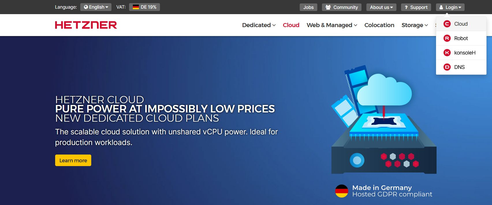
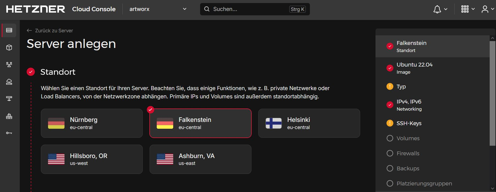
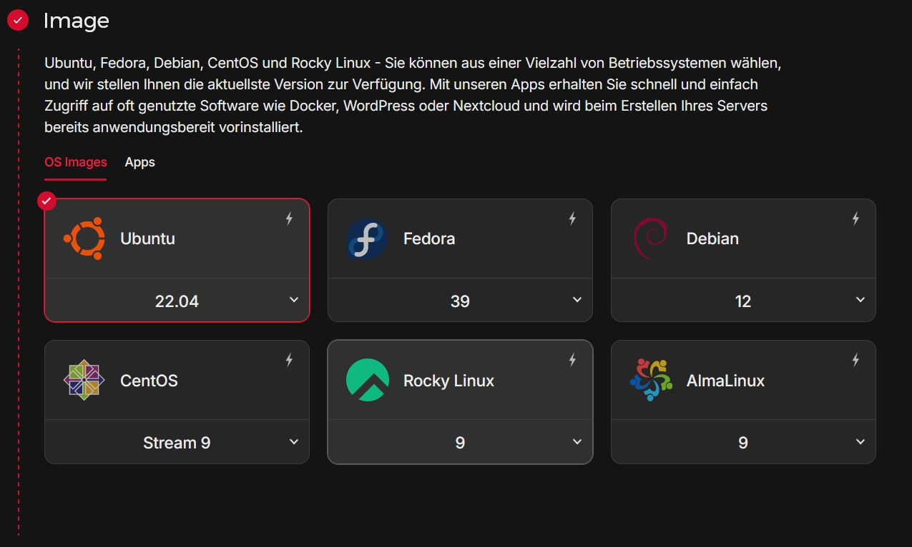
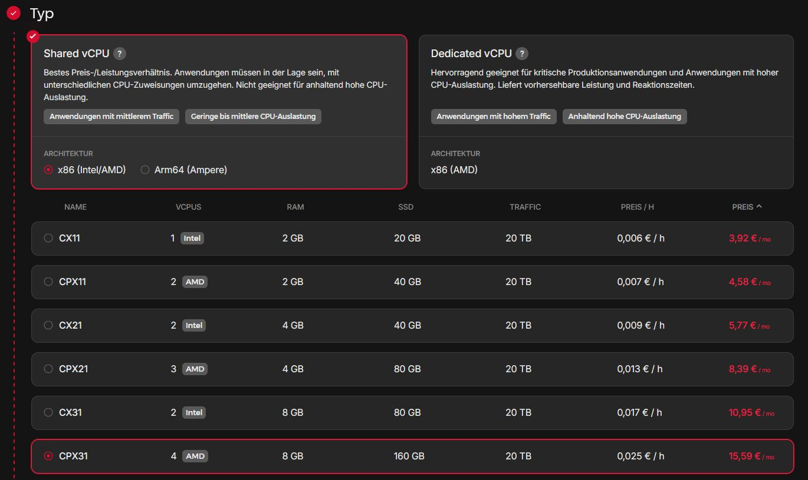
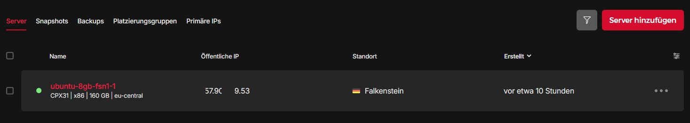
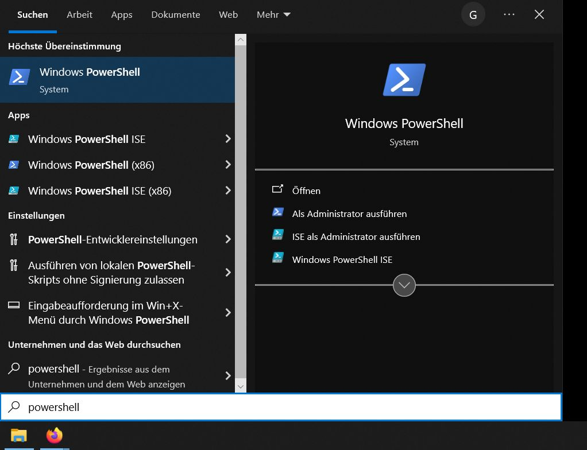

# Hands on Artwork

Dies ist ein Fork des Projektmanagement-Tools artwork.
Die Sophiensaele beteiligen sich an der Weiterentwicklung dieser Software. Im Sinne der AGPL-3.0 Lizenz, kommen Änderungen und weitere Entwicklungen dem Projekt zugute.

## Motivation
Ziel dieser Anleitung ist es, Artwork innerhalb weniger Stunden einsatzbereit zu bekommen. Eine Methode dafür ist die Nutzung eines Virtual Private Servers (VPS) - ein virtualisierter Rechenknoten mit softwaredefinierter begrenzter Rechenleistung. Bei einem VPS teilen sich mehrere Nutzer die gleiche Hardware auf der Serveranwendungen ausgeführt werden. Im Gegensatz zu einem dezidierten Server wo ein Nutzer das Gerät alleine nutzt, stellt ein VPS eine  kostengünstige Alternative dar.

Dank der Konfiguration über eine öffentliche IP-Adresse kann die Installation auf einer eigenen Domain zugänglich gemacht werden. Dies ermöglicht es, die Software sowohl intern als auch extern für Zugriffe verfügbar zu machen. Dies ist auch für eine artwork-Testumgebung nützlich.

 >**Diese Dokumentation bezeiht sich auf eine Installation von artwork für eine produktive Nutzung in prototypischer Form.**

Es wird darauf hingewiesen, dass diese Dokumentation noch in Bearbeitung ist und kontinuierlich erweitert wird.

Diese Anleitung wird auf Deutsch verfasst.  

______________________

`Hinweis: Die Installation der Tool-Chain (Visual Basic, VS Code, Docker, Laravel etc) für eine Weiterentwicklung von artwork ist in Arbeit.`

________________

## Was ist Artwork ? 

> https://github.com/artwork-software/artwork

*Eine Übersetzung des offiziellen Git-Repo von Artwork.*


Artwork ist ein Werkzeug zur Projektorganisation, das die Planung von Projekten mit mehreren Ereignissen, Aufgaben und Verantwortlichkeiten ermöglicht. Es soll dabei helfen, alle wesentlichen Komponenten der Projekte im Blick zu behalten.

## Was ist [Laravel](https://laravel.com/) ?

Laravel ist ein PHP-Framework, das für die Entwicklung von Webanwendungen konzipiert ist und um die Organisation des Codes zu erleichtern. Dieses Framework bietet eine Struktur, die es einfacher macht, große und komplexe Webanendungen systematisch zu entwickeln.


### [Laravel Sail](https://laravel.com/docs/11.x/sail)

Laravel Sail ist ein Befehlszeilentool zur Verwaltung der Docker-basierten Entwicklungsumgebung für Laravel. Sail erleichtert das Setup und die Verwaltung der Entwicklungsumgebung durch die Bereitstellung von Docker Containern.

## Ok, und Docker?

Docker ist ein Werkzeug, das die Erstellung, den Versand und den Betrieb von Anwendungen erleichtert, indem es sie in sogenannten Containern verpackt. Container können Sie sich als leichtgewichtige, tragbare und eigenständige Pakete vorstellen, die alle notwendigen Komponenten enthalten, um eine Software auszuführen, einschließlich der Bibliotheken, Systemtools, Code und Laufzeitumgebungen.


### Verwendung von Laravel Sail

- **Setup**: Sail ermöglicht das einfache Einrichten einer Entwicklungsumgebung mit vordefinierten Docker Containern.
- **Verwaltung**: Sail bietet Befehle zum Starten, Stoppen und Verwalten von Docker Containern.


Artwork kann entweder als eigenständige Anwendung für dedizierte Server oder als Multi-Container-App, die durch Docker unterstützt wird, installiert werden.
Standalone


_______________________________


## Entwicklungpfade von Artwork ( Branches )

- **Entwicklungszweig (dev Branch)**: Dient als primärer Entwicklungsast, auf dem Entwickler ihre Bausteine testen. Er wird genutzt, um neue Funktionen und Experimente zu integrieren.

- **Staging-Zweig (staging Branch)**: Funktioniert als Testserverumgebung und kann als Betaversion betrachtet werden. Er wird für Tests vor der Veröffentlichung verwendet.

- **Hauptzweig (main Branch)**: Dieser Zweig ist der stabile Entwicklungspfad und sollte als Grundlage für alle Produktionssysteme genutzt werden. Es enthält die zuverlässigste und am gründlichsten getestete Version des Codes.


`Die vorliegende Anleitung bezieht sich auf den Inhalt im Hauptentwicklungszweig „main“.`
  
  
Im offizielen Repository befinden sich weitere Entwicklungspfade (Branches), die von einzellnen Entwicklern im Projekt genutzt werden.


___________________________


## Voraussetzungen


### Systemvoraussetzungen


### Serveranforderungen für Artwork

Artwork funktioniert auf verschiedenen Betriebssystemen, empfiehlt jedoch die Verwendung von `Ubuntu Server (22.04 LTS)` für optimale Stabilität. Abhängig von der Anzahl der Benutzer, die die Anwendung gleichzeitig nutzen werden, variieren die Hardwareanforderungen:

### Minimale Ausstattung
| Ressource      | Spezifikation                      |
| -------------- | ---------------------------------- |
| **vCPU**       | 4 Kerne                            |
| **RAM**        | 8 GB                               |
| **SSD-Speicher** | 256 GB (+ zusätzlicher Speicher abhängig von der Nutzung) |

### Optimale Ausstattung
| Ressource      | Spezifikation                      |
| -------------- | ---------------------------------- |
| **vCPU**       | 8 Kerne                            |
| **RAM**        | 16 GB                              |
| **SSD-Speicher** | 512 GB (+ zusätzlicher Speicher abhängig von der Nutzung) |


### Anforderungen Cloud Computing
#### Hetzner


Hetzner ist ein deutsches Unternehmen, das eine breite Palette von Internet-Hosting-Diensten  anbietet. Es wurde 1997 gegründet und hat sich seitdem zu einem der bekanntesten Anbieter in Deutschland und Europa entwickelt. Hetzner bietet verschiedene Dienstleistungen an, darunter Webhosting, VPS (Virtual Private Servers)und dedizierte Server.

[Hetzner](https://hetzner.com/) 


Ein Auszug aus der Produktpalette. Für ersten Test werden geringe Ressourcen benötigt. 
Für eine langjährige Nutzung mit vielen zeitgleichen Nutzern sollte **CCX33** gewählt werden.
Hier wird **CCX23** gewählt.

| Modell | vCPU  Kerne  | RAM    | NVMe SSD | Traffic | IPv4 | Standorte | Preis pro Stunde | Preis pro Monat |
|--------|--------|--------|----------|---------|------|-----------|------------------|-----------------|
| CCX13  | 2 AMD  | 8 GB   | 80 GB    | 20 TB   | IPv4 |           | 0,0238 €         | 14,86 €         |
|  **★** CCX23  **★** | 4 AMD  | 16 GB  | 160 GB   | 20 TB   | IPv4 |           | 0,0466 €         | 29,14 €         |
| CCX33  | 8 AMD  | 32 GB  | 240 GB   | 30 TB   | IPv4 |           | 0,0925 €         | 57,70 €         |
| CCX43  | 16 AMD | 64 GB  | 360 GB   | 40 TB   | IPv4 |           | 0,1840 €         | 114,82 €        |
| CCX53  | 32 AMD | 128 GB | 600 GB   | 50 TB   | IPv4 |           | 0,3671 €         | 229,06 €        |
| CCX63  | 48 AMD | 192 GB | 960 GB   | 60 TB   | IPv4 |           | 0,5501 €         | 343,30 €        |


Derzeit wird nur Ubuntu unterstützt!
Es wird ein Root-Konto oder ein Benutzer mit Sudo-Rechten auf dem Ubuntu-System benötigt. Die Installation per Installations-Skript erfolgt vollautomatisch.


### Web-Konfiguration Hetzner


```python
from IPython.display import Image
Image("hetzner1.jpg")
```


    

    


```python
from IPython.display import Image
Image("hetzner2.jpg")
```


    

    


```python
from IPython.display import Image
Image("hetzner3.jpg")
```


    

    


```python
from IPython.display import Image
Image("hetzner4.jpg")
```


    

    


```python

```


```python

```

## Server anlegen
___________
### Standort

Hier wird **Falkenstein** gewählt
_____________
### Image

- **Betriebssystem**: Ubuntu 22.04 Long time support

_______________
## Networking


- **IPv4-Kosten**: 0,00095 €/h für Primäre IPv4-Adressen, unabhängig von der Zuweisung.
- **IPv6-Adressen**: Kostenlos. hehe

Standard Einstellungen
__________________
### SSH-Keys

- **Sicherheit**: Authentifizierung über SSH-Keys sicherer als herkömmliche Passwort-Authentifizierung.
- 
- **Format**: SSH-Key muss im OpenSSH-Format vorliegen. Es muss auf dem lokalen Computer ein SSH -Schlüsselpaar erzeugt werden.

<font color="red">Dieser Schritt wird hier übersprungen.</font>

 
 Verwendung eines SSH-Keys wird empfohlen; sonst wird <font color="green">**ein Root-Passwort per E-Mail** versendet. </font>

_______________________
### Volumes

kein weiterer Speicherplatz
______________________
### Firewalls

none
____________________
### Backups


In produktiver Umgebung kann dieser Backup-Dienst nützlich sein, ist aber vergleichmäßig teuer. 

- **Kosten**: Monatliche Kosten von 20% des Serverpreises; Volumes nicht in Backups enthalten.

_________________________
### Servername

Ganz unten muss ein Servername vergeben werden. Sonst bekommt man eine kryptische Kennung als Namen vergeben.

```
artwork
```

___________

### Öffentliche IP-Adresse

Hetzner vergibt eine öffentliche IPv4-Adresse.
Unter dieser Adresse ist der VPS-Rechenknoten nun über das Internet erreichbar.


```python
from IPython.display import Image
Image("hetzner5.jpg")
```


    

    


_____________________
## Setzen von DNS-Records bei einem Domain-Register

Für eine IPv4 - Adresse muss mindestesn ein `A - Record` bei einem Domain-Register gesetzt werden.

### Setzen eines A -Records

Um die Artwork-Installation über das Internet erreichbar zu machen, muss ein Domain-Record gesetzt werden.

Die **Subdomain** ist: `artwork`

Die **Domain** ist: `meinefirma`

Die **Top-Level-Domain** ist zu Beispiel: `.de`

Zusammen also: `artwork.mainefirma.de`

Es ist ein A Record in den DNS Einträgen zu setzen.

`artwork ` der `öffentlichen IP-Adresse` von Hetzner zuweisen.

#### Zusätzliche Domain Records:

- AAAA -Record für IPv6 Erreichbarkeit
- MX -Record für Emailversand vom gleichen Server (falls nötig)
- TXT - Record (fortgeschrittene nutzung)
____________________________

______
__________

## Root-Zugang per SSH mit der Powershell


```python
from IPython.display import Image
Image("powershell1.jpg")
```


    

    


Um über die PowerShell eine SSH-Verbindung zu einem Server herzustellen und den Fingerprint zu bestätigen, werden folgende Schritte durchgeführt:

1. Ein root-Passwort wird an die Email-Adresse des Hetzner Kontos gesendet. Diese Logindaten nutzen um per SSH- Fernzugriff zu verbinden.
    - IP-Adresse
    - root-Nutzer
     - root-Passwort

3.  Auf dem lokalen System wird die PowerShell geöffnet.

SSH-Verbindung aufbauen:
Der SSH-Befehl wird verwendet, um eine Verbindung zum VPS herzustellen:
```bash
ssh root@123.245.123
```


Ersetzen von der IP-Adresse mit der tatsächlichen IP-Adresse des VPS-Servers.

2. Fingerprint bestätigen:

Bei der ersten Verbindung zu einem Server über SSH wird der SSH-Fingerprint des Servers angezeigt.
PowerShell fragt, ob man dem Host vertrauen möchte. Um fortzufahren, muss `yes` eingegeben und bestätigt werden, um den Fingerprint zu akzeptieren und die Verbindung zu sichern.

3. Verbindung herstellen und Testkommando ausführen:

```
whoami
```

____________________
____________________


## Erste Schritte auf einem VPS
### Benutzer hinzufügen

   - Befehl zum Hinzufügen eines neuen Benutzers "art":
```bash
adduser art
```
   - Passwort für den neuen Benutzer eingeben und durch erneute Eingabe bestätigen.
___________
### Benutzer zu sudoers hinzufügen 
   - sudoers-Datei mit einem Editor öffnen, z.B.:
```bash
nano /etc/sudoers
```

   - Folgende Zeile hinzufügen, um dem Benutzer `art` sudo-Rechte zu gewähren:

```bash
art ALL=(ALL) ALL
```

#### Änderungen speichern und schließen

Nach dem Hinzufügen der Zeile die Änderungen speichern und nano schließen. Dies erfolgt in nano durch Drücken von Ctrl+O (zum Speichern), Enter (zum Bestätigen des Dateinamens) und Ctrl+X (zum Schließen des Editors).

#### Alternative zu nano - Nutzung von visudo

Bei der Veränderung von `/etc/sudoers` ist es möglich, bei fehlerhaften Eingaben, sich selbst vom System auszusperren. Deshalb wird die Nutzung von `visudo` für das Ändern der `sudoers`Datei empfohlen, hier aber nicht beschrieben

_______________
### Zu Benutzer `art` wechseln
   - Zum neuen Benutzerkonto wechseln mit:
```bash
su art
```
____________________
### Paketquellen aktualisieren
   - Paketquellen des Systems aktualisieren:

```bash
sudo apt update
```
___________________
### weitere Pakete installieren
   - Pakete `fail2ban`, `ufw` (Uncomplicated Firewall) und `git` installieren:
```bash
sudo apt install fail2ban ufw git
```

__________
### UFW-Konfiguration

- **HTTPS freigeben**:

```bash
sudo ufw allow https
```


- **HTTP freigeben (Port 80)**:

```bash
sudo ufw allow 80
```

- **SSH freigeben**:
```bash
sudo ufw allow ssh
```


- **Nginx freigeben**:

```bash
sudo ufw allow 'Nginx Full'
```


- **UFW aktivieren**:
```bash
sudo ufw enable
```


- **UFW-Status überprüfen**:


```bash
sudo ufw status
```


Diese Befehle konfigurieren die Firewall so, dass sie den Zugriff auf wesentliche Web- und SSH-Dienste ermöglicht.

_____________

### Installation von Fail2Ban

Fail2Ban sichert den SSH Zugang per Passwort ab.

Zuerst muss Fail2Ban installiert werden:


```bash
sudo apt install fail2ban
```

#### Grundlegende Konfiguration von Fail2Ban

Fail2Ban wird mit einer Hauptkonfigurationsdatei (jail.conf) geliefert, die nicht direkt bearbeitet werden sollte, da Änderungen bei einem Update überschrieben werden können. Stattdessen erstellt man eine lokale Kopie (jail.local), die Vorrang hat.

Erstellen der lokalen Konfigurationsdatei

```bash
sudo nano /etc/fail2ban/jail.local
```

Es kann folgende Beispielkonfiguration eingefügt werden.

```bash
[DEFAULT]
# Sperrt Hosts für eine Stunde:
bantime = 3600

# Eine IP-Adresse wird gesperrt, wenn sie innerhalb von 10 Minuten 5 fehlgeschlagene Anmeldeversuche hat
findtime = 600
maxretry = 5

# Ignoriert lokale Netzwerkadressen
ignoreip = 127.0.0.1/8

# Aktion, die ausgeführt wird, ist das Sperren der IP
action = %(action_mwl)s

[sshd]
enabled = true
port    = ssh
filter  = sshd
logpath = /var/log/auth.log
maxretry = 3

```


__________________
____________________

## Installation von Artwork auf einem Ubuntu-Server
- Root-Zugang oder ein Benutzer mit Sudo-Rechten ist erforderlich.
- Die Installation erfolgt vollautomatisch ohne Eingabeaufforderungen.


### Wechsel in das Benutzerverzeichnis
   - Mit dem Benutzer `art` in das Home-Verzeichnis wechseln:
 ```bash
     cd /home/art
```
________
### Klonen des Artwork Git-Repository
   - Das Repository von GitHub klonen:
```bash
     git clone https://github.com/artwork-software/artwork.git
```
___________
### Wechsel in das Repository-Verzeichnis
   - In das geklonte Verzeichnis wechseln:
```bash
     cd artwork
```
__________
### Berechtigungen für das Installationsskript setzen
   - Dem Skript `ubuntu-install.sh` Ausführungsrechte geben:
```bash
     chmod 755 ubuntu-install.sh
```
___________
### Ausführen des Installationsskripts
   - Das Installationsskript ausführen:
```bash
     ./ubuntu-install.sh
```
_____________
Dieses Skript wird Artwork als eigenständige Anwendung installieren. Es umfasst die Einrichtung notwendiger Komponenten wie Nginx, PHP, und andere Abhängigkeiten, die für den Betrieb von Artwork erforderlich sind. 


### Was macht das Skript?


Installation von nginx als Webserver und Einrichtung einer Standardkonfiguration. Diese überschreibt die bestehende Standardkonfiguration. 


- Installation von MySQL 8 und Erstellung eines Benutzerkontos für die Anwendung sowie Befüllung der Datenbank.
- Installation von NodeJs in der Version 18.x (LTS).
- Erstellung eines Dienstes für den Queue-Worker.
- Einrichtung eines Cronjobs für geplante Zeitpläne.
- Installation von Soketi (global) als Pusher-kompatibler Dienst und dessen Daemonisierung.
- Einrichtung und Installation von PHP mit allen benötigten Plugins.
- Installation von Meilisearch.
- Installation von Artwork selbst.

Es wird dringend davon abgeraten, den Installer mehrmals auszuführen, da einige Schritte nur einmal ausgeführt werden sollen.

### Was macht das Skript nicht?

- SSL Zertifikate

___________
______________

## SSL-Zertifikatinstallation für Artwork auf einem Ubuntu-Server

____________

### Let's Encrypt

bietet eine automatisierte Dienstleistung zur Ausstellung von SSL/TLS-Zertifikaten an, die verschlüsselte Verbindungen via `https`   im Internet ermöglicht. Um diesen Dienst zu nutzen, ist das Dienstprogramm `Certbot` zu empfehlen.
     
     


### Certbot und Nginx installieren
Zuerst müssen Certbot und Nginx installiert werden, falls noch nicht geschehen:
```bash
     sudo apt update
     sudo apt install certbot python3-certbot-nginx
```

### Certbot für automatische SSL-Konfiguration verwenden
   - Certbot automatisiert die SSL-Konfiguration für Nginx und erneuert die Zertifikate:
```bash
     sudo certbot --nginx --redirect --agree-tos --no-eff-email --email meine@mail.de -d artwork.meinewebsite.de
```
   - Optionen erklärt:
     - `--nginx`: Verwendet den Nginx-Plugin.
     - `--redirect`: Erstellt eine Umleitung von HTTP zu HTTPS.
     - `--agree-tos`: Stimmt den Nutzungsbedingungen automatisch zu.
     - `--no-eff-email`: Verzichtet auf zusätzliche E-Mails außer Erneuerungsbenachrichtigungen.
     - `--email`: Gibt die E-Mail-Adresse für wichtige Benachrichtigungen an.
     - `-d`: Spezifiziert die Domain für das SSL-Zertifikat. <-- Super Wichtig!
   
   __________________
   
   
   Die erstellen Dateien sind Teile des SSL-Zertifikats, das von `Let's Encrypt` bereitgestellt wird:

```bash
/etc/letsencrypt/live/artwork.meinewebsite.de/fullchain.pem
```
Diese Datei enthält das SSL-Zertifikat zusammen mit allen Zwischenzertifikaten.

```bash
/etc/letsencrypt/live/artwork.meinewebsite.de/privkey.pem
```
Diese Datei enthält den privaten Schlüssel des Zertifikats.


______________________

### SSL-Zertifikat nicht erfolgreich installiert
Bei vorhandenem DNS-Record zu einer Domain meldet Certbot ein Zertifikat bei LetsEncrypt an.
Durch die Standard-Nginx Konfiguration von artwork muss das Zertifikat manuell gesetzt werden. Certbot gibt dort einen Fehler aus. Den Pfad des gelandenen Zertifikat kopieren. 
In der Datei 

```bash
sudo nano /etc/nginx/sites-enabled/default
```

müsen die Pfade zu den Zertifikaten von oben  manuell gesetzt werden.


```bash
map $http_upgrade $connection_upgrade {
    default upgrade;
    '' close;
}

server {
    listen 80;
    server_name artwork.meinewebsite.de;
    listen 443 ssl;
    ssl_certificate /etc/letsencrypt/live/artwork.meinewebsite.de/fullchain.pem;
    ssl_certificate_key /etc/letsencrypt/live/artwork.meinewebsite.de/privkey.pem;

# Empfohlene SSL-Einstellungen
    ssl_protocols TLSv1.2 TLSv1.3;
    ssl_ciphers 'ECDHE-ECDSA-CHACHA20-POLY1305:ECDHE-RSA-AES128-GCM-SHA256:ECDHE-RSA-AES256-GCM-SHA384';
    ssl_prefer_server_ciphers on;
    ssl_session_cache shared:SSL:10m;

    #SSL Settings
    #ssl_certificate /poth/to/cert;
    #ssl_certificate_key /path/to/key;
    #listen 443 ssl;

    root /var/www/html/public;
    index index.php index.html;

    location ~ \.php$ {
       try_files $uri =404;

       fastcgi_split_path_info ^(.+\.php)(/.+)$;
       fastcgi_pass unix:/run/php/php8.2-fpm.sock;
       fastcgi_index index.php;

       include fastcgi_params;
       fastcgi_param SCRIPT_FILENAME $document_root$fastcgi_script_name;
       fastcgi_param PATH_INFO $fastcgi_path_info;
    }

    location / {
      try_files $uri $uri/ /index.php$is_args$args;
    }
}

```


Die Datei, die Sie hier beschrieben ist, ist eine .env-Datei (Environment-Konfigurationsdatei) für eine Laravel-basierte Anwendung, die auf dem Server läuft. Diese Datei enthält Umgebungsvariablenn für die Anwendung. Umgebungsvariablen sind Schlüssel-Wert-Paare, die zur Konfiguration von Aspekten der Anwendungsumgebung verwendet werden, ohne den Code zu ändern.


Die .env-Datei im Verzeichnis 

```bash
sudo nano /var/www/html/.env 
``` 
bearbeiten.
Den Eintrag APP_URL=http://localhost finden und http://localhost durch die eigene Domain ersetzen. HTTP oder HTTPS sind erforderlich.

Hier ein Beispiel wie es mit der Domain `https://artwork.meinewebsite.de` zu konfigurieren ist.

```bash

art@ubuntu-8gb-fsn1-1:/var/www/html$ cat /var/www/html/.env
APP_NAME=Artwork
APP_ENV=production
APP_KEY=base64:VFib2131231tW1418uoJLG1231i29/Y6Yp3TFOg=
APP_DEBUG=false
APP_URL=https://artwork.meinewebsite.de

LOG_CHANNEL=stack
LOG_DEPRECATIONS_CHANNEL=null
LOG_LEVEL=debug

TEST_DB_DATABASE=artwork_tools_test
DB_CONNECTION=mysql
DB_HOST=localhost
DB_PORT=3306
DB_DATABASE=artwork_tools
DB_USERNAME=artwork
DB_PASSWORD=082fd74e0asd39dfewqdwdqeqedal-als-ob-bruder-46abac01e1308e00

SCOUT_DRIVER=meilisearch
MEILISEARCH_HOST=http://localhost:7700
SCOUT_QUEUE=true

CACHE_DRIVER=redis
FILESYSTEM_DISK=local
QUEUE_CONNECTION=database
SESSION_DRIVER=redis
SESSION_LIFETIME=120

MEMCACHED_HOST=127.0.0.1

REDIS_HOST=127.0.0.1
REDIS_PASSWORD=null
REDIS_PORT=6379

MAIL_HOST=
MAIL_PORT=
MAIL_MAILER=
MAIL_USERNAME=Inbox-Name
MAIL_PASSWORD=
MAIL_ENCRYPTION=

AWS_ACCESS_KEY_ID=
AWS_SECRET_ACCESS_KEY=
AWS_DEFAULT_REGION=us-east-1
AWS_BUCKET=
AWS_USE_PATH_STYLE_ENDPOINT=false

BROADCAST_DRIVER=pusher
PUSHER_APP_KEY=122345
PUSHER_APP_ID=123345
PUSHER_APP_SECRET=112345
PUSHER_APP_CLUSTER=mt1
PUSHER_HOST=ip adresse hier einsetzen <------    xxx.xxx.xxx.xxx
PUSHER_PORT=6001
PUSHER_SCHEME=https

MIX_PUSHER_APP_KEY="${PUSHER_APP_KEY}"
MIX_PUSHER_HOST="${PUSHER_HOST}"
MIX_PUSHER_PORT="${PUSHER_PORT}"

LARAVEL_WEBSOCKETS_PORT=${PUSHER_PORT}
DEBUGBAR_ENABLED=FALSE

SENTRY_LARAVEL_DSN=
SENTRY_TRACES_SAMPLE_RATE=1.0
VITE_SENTRY_DSN_PUBLIC="${SENTRY_LARAVEL_DSN}"


SOKETI_SSL_CERT=/etc/letsencrypt/live/artwork.meinewebsite.de/fullchain.pem
SOKETI_SSL_KEY=/etc/letsencrypt/live/artwork.meinewebsite.de/privkey.pem
SOKETI_SSL_CA= # Optional, wenn eine CA verwendet wird
SOKETI_SSL_PASS= # Optional, wenn ein Passwort für den Schlüssel benötigt wird


```
__________

_____________


### Für E-Mail-Support
Für automatische Email wird ein SMTP-Server benötigt.

Im selben File den folgenden Block lokalisieren und mit den eigenen Zugangsdaten ausfüllen:

```bash
MAIL_HOST=smtp.example.com
MAIL_PORT=587 (Beispielport - kann abweichen)
MAIL_MAILER=smtp
MAIL_USERNAME=your-email@example.com
MAIL_PASSWORD=your-email-password
MAIL_ENCRYPTION=tls

```
_________________
_______________  
  
  ## Updateprozess der Standalone-Installation
  
Um das Skript `update.sh` im Verzeichnis `artwork` auszuführen sind folgende Befehle erforderlich.


```bash
cd artwork
chmod 755 update.sh
./update.sh
```

Das `update.sh` Skript benötigt root-User Privilegien, da es Befehle mit `sudo` ausführt.
  
  
  ```bash
  
  #!/usr/bin/env bash

#Update OS
sudo apt-get update
sudo NEEDRESTART_MODE=a apt-get dist-upgrade -y

#Get new code
sudo git -C /var/www/html pull

#Install dependencies
sudo COMPOSER_ALLOW_SUPERUSER=1 php /var/www/html/composer.phar -d /var/www/html --no-interaction install

sudo chown -R www-data:www-data /var/www/html

#Clear cache and update db
sudo php /var/www/html/artisan cache:clear
sudo php /var/www/html/artisan optimize
sudo php /var/www/html/artisan migrate --force

## Setup js
sudo npm --prefix /var/www/html install
#First dev, then prod to bake the keys into soketi(pusher)
sudo npm --prefix /var/www/html run dev
sudo npm --prefix /var/www/html run prod

sudo chown -R www-data:www-data /var/www/html

sudo systemctl restart artwork-worker


```


### Hauptaufgaben des Skripts `update.sh`:

#### Betriebssystem aktualisieren:
   
   Es stellt sicher, dass das Betriebssystem, auf dem der Server läuft, die neuesten Sicherheitspatches und Updates erhält.
   
   
   ___________________
   
   
##### Neuesten Quellcode holen:
   
   Das Skript aktualisiert den Code der Webanwendung auf dem Server, indem es die neueste Version aus dem offiziellen Git-Repository zieht.
   
   ______________
   
   
   
#### Abhängigkeiten installieren:


   
   Alle erforderlichen PHP- und JavaScript-Bibliotheken und -Pakete werden installiert oder aktualisiert.
   
   
   
   ____________
   
#### Anwendungsressourcen und Datenbank aktualisieren:
   
   Das Skript führt Befehle aus, die spezifisch für (php) Laravel sind, wie das Löschen des Caches oder das Durchführen von Datenbankmigrationen
   
   _____________________
   
#### Dienste neu starten:
   
  Nachdem alle Updates durchgeführt wurden, wird der spezifische Dienst der Anwendung (ein Background Worker) neu gestartet, um alle Änderungen zu übernehmen und die Anwendung neu zu starten.
________________________  
___________________________

## Backup-Management in `artwork`

Backups sind entscheidend für die Absicherung von Daten und deren Wiederherstellung nach Datenverlust durch Systemfehler oder Datenkorruption. Für die MySQL-Datenbank der Software `Artwork` sollte ein regelmäßiges Backup erstellt werden. In einer produktiven Umgebung sollte dies in festen Invervallen geschehen.

Das hier beschriebene Verfahren ermöglicht das Exportieren von Backups der "Artwork"-Datenbank und die Archivierung lokal. Diese Anleitung demonstriert, wie ein manuelles Backup erstellt wird. Um menschliche Fehler zu minimieren, wird empfohlen, den Backup-Prozess per Skript zu automatisieren.

### Werkzeugkette Datenbank-Management


### Grafische Benutzeroberflächen (GUIs) für Datenbanksysteme:

1. **MySQL Workbench**: [MySQL Workbench Webseite](https://www.mysql.com/products/workbench/)
2. **phpMyAdmin**: [phpMyAdmin Webseite](https://www.phpmyadmin.net/)
3. **DBeaver**: [DBeaver Webseite](https://dbeaver.io/)
  
_______________  

### Installation mit dem Paketmanager Scoop unter Windows

**Scoop** ist ein Kommandozeilen-Installer für Windows, der das Installieren und Verwalten von Anwendungen vereinfacht.

**Projektwebseite**: [Scoop Webseite](https://scoop.sh/)

### Installation von Scoop Paketmanager:
PowerShell öffnen und folgenden Befehl ausführen:
```bash
Set-ExecutionPolicy RemoteSigned -Scope CurrentUser
iwr -useb get.scoop.sh | iex
```

### Installieren von Git mit Scoop

```bash
scoop install git
```
Git wird für die scoop Paketverwaltung benötigt.


### Hinzufügen des Extras-Buckets in Scoop:
```bash
scoop bucket add extras
```

### Suche nach Paketen mit Scoop:
```bash
scoop search sql
```

Diese Suche gibt alle Software aus, die mit scoop zu installieren ist. Dabei auch MySQL - Workbench.  

### Installation von MySQL Workbench mit Scoop:
```bash
scoop install mysql-workbench
```