# Hands on Artwork

Dies ist ein Fork des Projektmanagement-Tools artwork.
Die Sophiensaele beteiligen sich an der Weiterentwicklung dieser Software. Im Sinne der AGPL-3.0 Lizenz, kommen Änderungen und weitere Entwicklungen dem Projekt zugute.

## Motivation
Ziel dieser Anleitung ist es, Artwork innerhalb weniger Stunden einsatzbereit zu bekommen. Eine Methode dafür ist die Nutzung eines Virtual Private Servers (VPS) - ein virtualisierter Rechenknoten mit softwaredefinierter begrenzter Rechenleistung. Bei einem VPS teilen sich mehrere Nutzer die gleiche Hardware auf der Serveranwendungen ausgeführt werden. Im Gegensatz zu einem dezidierten Server wo ein Nutzer das Gerät alleine nutzt, stellt ein VPS eine  kostengünstige Alternative dar. 

Dank der Konfiguration über eine öffentliche IP-Adresse kann die Installation auf einer eigenen Domain zugänglich gemacht werden. Dies ermöglicht es, die Software sowohl intern als auch extern für Zugriffe verfügbar zu machen. 

 >**Diese Dokumentation bezeiht sich auf eine Installation von artwork für eine Nutzung in prototypischer Form.**


Diese Anleitung wird auf Deutsch verfasst.  

Die Entwicklungswerkzeuge von Artwork werden zu Beginn vorgestellt.


________________

## Was ist Artwork ? 


Artwork ist ein Werkzeug zur Projektorganisation, das die Planung von Projekten mit mehreren Ereignissen, Aufgaben und Verantwortlichkeiten ermöglicht. 

> https://github.com/artwork-software/artwork


Dank an Caldero Systems (https://caldero-systems.de/) die Open-Source-Veröffentlichung von Artwork.


## Was ist [Laravel](https://laravel.com/) ?

Laravel ist ein PHP-Framework, das für die Entwicklung von Webanwendungen konzipiert ist und um die Organisation des Codes zu erleichtern. Dieses Framework bietet eine Struktur, die es einfacher macht, große und komplexe Webanendungen systematisch zu entwickeln.


### [Laravel Sail](https://laravel.com/docs/11.x/sail)

Laravel Sail ist ein Befehlszeilentool zur Verwaltung der Docker-basierten Entwicklungsumgebung für Laravel. Sail erleichtert das Setup und die Verwaltung der Entwicklungsumgebung durch die Bereitstellung von Docker Containern.

## Ok, und Docker?

Docker ist ein Werkzeug, das die Erstellung, den Versand und den Betrieb von Anwendungen erleichtert, indem es sie in sogenannten Containern verpackt. Container können Sie sich als leichtgewichtige, tragbare und eigenständige Pakete vorstellen, die alle notwendigen Komponenten enthalten, um eine Software auszuführen, einschließlich der Bibliotheken, Systemtools, Code und Laufzeitumgebungen.


### Verwendung von Laravel Sail

- **Setup**: Sail ermöglicht das einfache Einrichten einer Entwicklungsumgebung mit vordefinierten Docker Containern.
- **Verwaltung**: Sail bietet Befehle zum Starten, Stoppen und Verwalten von Docker Containern.


Artwork kann entweder als eigenständige Anwendung für dedizierte Server oder als Multi-Container-App, die durch Docker unterstützt wird, installiert werden.
Standalone


_______________________________


## Entwicklungpfade von Artwork ( Branches )

> artwork: a free project management software for the arts 
>  
>offical :
> https://github.com/artwork-software/artwork?tab=readme-ov-file


- **Entwicklungszweig (dev Branch)**: Dient als primärer Entwicklungsast, auf dem Entwickler ihre Bausteine testen. Er wird genutzt, um neue Funktionen und Experimente zu integrieren.

- **Staging-Zweig (staging Branch)**: Funktioniert als Testserverumgebung und kann als Betaversion betrachtet werden. Er wird für Tests vor der Veröffentlichung verwendet.

- **Hauptzweig (main Branch)**: Dieser Zweig ist der stabile Entwicklungspfad und sollte als Grundlage für alle Produktionssysteme genutzt werden. Es enthält die zuverlässigste und am gründlichsten getestete Version des Codes.
`
  
  

______________________

`Hinweis: Die Installation der Tool-Chain (Visual Basic, VS Code, Docker, Laravel etc) für eine Weiterentwicklung von artwork ist in Arbeit.`


## Entwicklungswerkzeuge von Artwork


### WSL : Windows subsystem for Linux

#### Was ist WSL?

________________

WSL steht für Windows Subsystem for Linux. Es ist eine Kompatibilitätsschicht, die von Microsoft entwickelt wurde, um einen Linux-Kernel innerhalb von Windows auszuführen. WSL ermöglicht es Benutzern, Linux-basierte Anwendungen direkt auf Windows zu nutzen, ohne die Notwendigkeit einer traditionellen virtuellen Maschine oder eines Dual-Boot-Setups. 

**Es existieren zwei Versionen von WSL:**

- WSL 1 verwendet eine Übersetzungsschicht, um Linux-Aufrufe in Windows-Systemaufrufe umzuwandeln.
- WSL 2 bietet eine verbesserte Version, die eine echte Linux-Kernel-Instanz verwendet, die vollständige Systemaufruf-Kompatibilität bietet.

WSL wird häufig von Entwicklern genutzt, die auf Windows-Plattformen arbeiten, aber Linux-spezifische Software oder Entwicklungsumgebungen benötigen. WSL kann über die Windows-Funktionen installiert werden, und verschiedene Linux-Distributionen können aus dem Microsoft Store heruntergeladen und installiert werden.

__________________

Diese Anleitung lässt den Microsoft Store aus.


_____________________

Es integriert sich nahtlos in Windows, wobei Dateisysteme zwischen Windows und Linux geteilt und Anwendungen zwischen den Betriebssystemen gestartet werden können.


Um das Windows Subsystem for Linux (WSL) auf einem Windows-System zu installieren, ohne dass WSL bereits installiert ist, sind folgende Schritte erforderlich:

_________________  


###  Windows-Features für WSL aktivieren

Zuerst müssen die notwendigen Features über die PowerShell aktiviert werden.


Hierfür ist es notwendig, die PowerShell als Administrator zu starten und die folgenden Befehle einzugeben:


```powershell
dism.exe /online /enable-feature /featurename:Microsoft-Windows-Subsystem-Linux /all /norestart
dism.exe /online /enable-feature /featurename:VirtualMachinePlatform /all /norestart
```

Diese Befehle aktivieren das "Windows-Subsystem für Linux" und die "Plattform für virtuelle Computer". Ein Neustart des Systems ist anschließend erforderlich.

__________________________


#### WSL installieren mit alternativer Methode per GUI


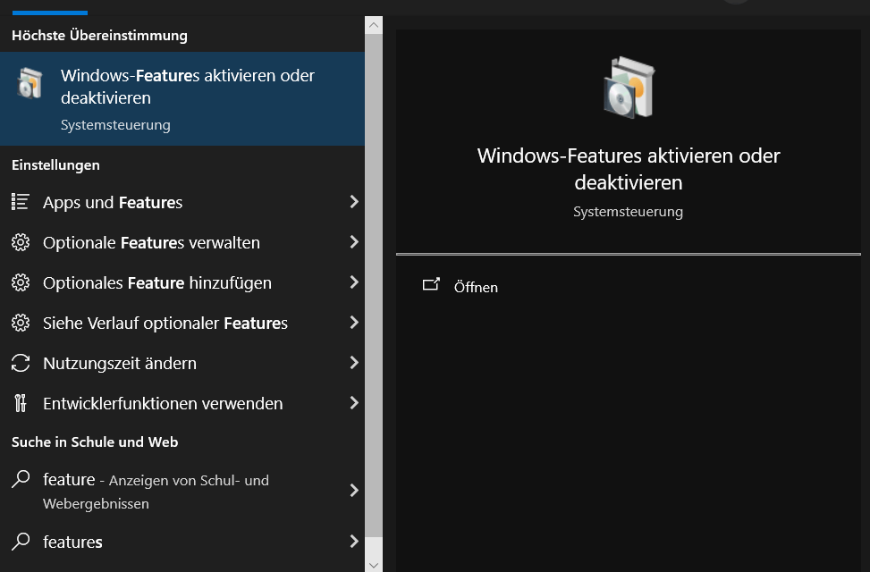


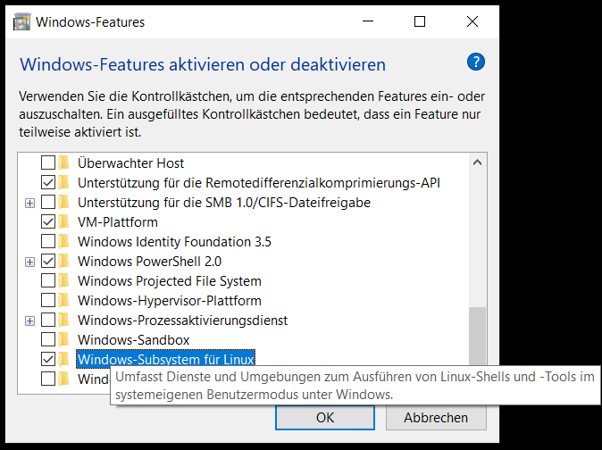


```bash
dism.exe /online /enable-feature /featurename:VirtualMachinePlatform /all /norestart
```
  
  


Der Befehl dism.exe /online /enable-feature /featurename:VirtualMachinePlatform /all /norestart wird in der PowerShell mit Administratorrechten ausgeführt. Er aktiviert die "Virtual Machine Platform", eine Funktion, die für virtuelle Maschinen erforderlich ist und von WSL 2 (Windows Subsystem for Linux) zur Unterstützung von Linux-Distributionen genutzt wird. Der Befehl sorgt dafür, dass diese Funktion sofort verfügbar wird, ohne dass ein Neustart des Systems erforderlich ist.


<div style="background-color: red; border-left: 6px solid #4caf50; padding: 8px; margin-top: 5px; margin-bottom: 5px;">
    <strong>Hinweis</strong> Den PC trotzdem neu starten
</div>


________________________


___________________  


### WSL Version prüfen: 

Um die aktuell installierte WSL-Version zu überprüfen, kann folgender Befehl verwendet werden:

  ```powershell
  wsl --status
  ```
  
  
  
  
  
  ____________
  
  
###  WSL-Update 


__________________________


  
  
  
  
  
  
###  WSL-Version festlegen

Falls eine spezifische WSL-Version benötigt wird, kann die Standardversion auf WSL 2 eingestellt werden. Dazu werden folgende Befehle in der PowerShell als Administrator ausgeführt:

```powershell
wsl --set-default-version 2
```

Dieser Befehl legt WSL 2 als Standardversion fest, welche vollständige Systemaufruf-Kompatibilität bietet.


___________


  
  

###  WSL-Linux-Distributionen auflisten

Nach der Initialisierung von WSL können Linux-Distributionen über den Microsoft Store hinzugefügt werden. Im Microsoft Store wird nach der gewünschten Linux-Distribution gesucht (z.B. Ubuntu, Debian, Fedora) und diese installiert.


Die folgende Anleitung zeigt wie es mit der Powershell gelingt WSL zu installieren.

Der folgende Befehl listet alle verfügbaren WSL-Versionen.

```powershell
wsl --list --online
```


```powershell

PS C:\Users\localadmin> wsl --list --online
Nachstehend finden Sie eine Liste der gültigen Distributionen, die installiert werden können.
Führen Sie die Installation mithilfe des Befehls „wsl.exe --install <Distro>“ aus.

NAME                                   FRIENDLY NAME
Ubuntu                                 Ubuntu
Debian                                 Debian GNU/Linux
kali-linux                             Kali Linux Rolling
Ubuntu-18.04                           Ubuntu 18.04 LTS
Ubuntu-20.04                           Ubuntu 20.04 LTS
Ubuntu-22.04                           Ubuntu 22.04 LTS
Ubuntu-24.04                           Ubuntu 24.04 LTS
OracleLinux_7_9                        Oracle Linux 7.9
OracleLinux_8_7                        Oracle Linux 8.7
OracleLinux_9_1                        Oracle Linux 9.1
openSUSE-Leap-15.5                     openSUSE Leap 15.5
SUSE-Linux-Enterprise-Server-15-SP4    SUSE Linux Enterprise Server 15 SP4
SUSE-Linux-Enterprise-15-SP5           SUSE Linux Enterprise 15 SP5
openSUSE-Tumbleweed                    openSUSE Tumbleweed
PS C:\Users\localadmin>

```

______________________

###  Linux-Distribution installieren


Mit folgendem Befehl ist die Ubunte 22.04 LTS Distribution zu installieren:

```powershell
wsl --install -d Ubuntu-22.04
```


```powershell
PS C:\Users\localadmin\WSL2-Linux-Kernel> wsl --install -d Ubuntu-22.04
Der angeforderte Vorgang erfordert erhöhte Rechte.
Optionale Windows-Komponente wird installiert: VirtualMachinePlatform

Tool zur Imageverwaltung für die Bereitstellung
Version: 10.0.19041.3636

Abbildversion: 10.0.19045.4291

Features werden aktiviert
[==========================100.0%==========================]
Der Vorgang wurde erfolgreich beendet.
Der angeforderte Vorgang wurde erfolgreich abgeschlossen. Änderungen werden erst nach einem Neustart des Systems wirksam
.
Wird installiert: Ubuntu 22.04 LTS
Ubuntu 22.04 LTS wurde installiert.
Der angeforderte Vorgang wurde erfolgreich abgeschlossen. Änderungen werden erst nach einem Neustart des Systems wirksam.
PS C:\Users\localadmin\WSL2-Linux-Kernel>

```


<div style="background-color: red; border-left: 6px solid #4caf50; padding: 8px; margin-top: 5px; margin-bottom: 5px;">
    <strong>Hinweis</strong> Den PC noch einmal neu starten
</div>


______________

### Ubuntu via Startmenü verfügbar


Nach dem Neustart ist eine Ubuntu-Umgebung via Startmenü als Windows-App verfügbar. Mit ENTER startet eine Ubuntu-Shell.


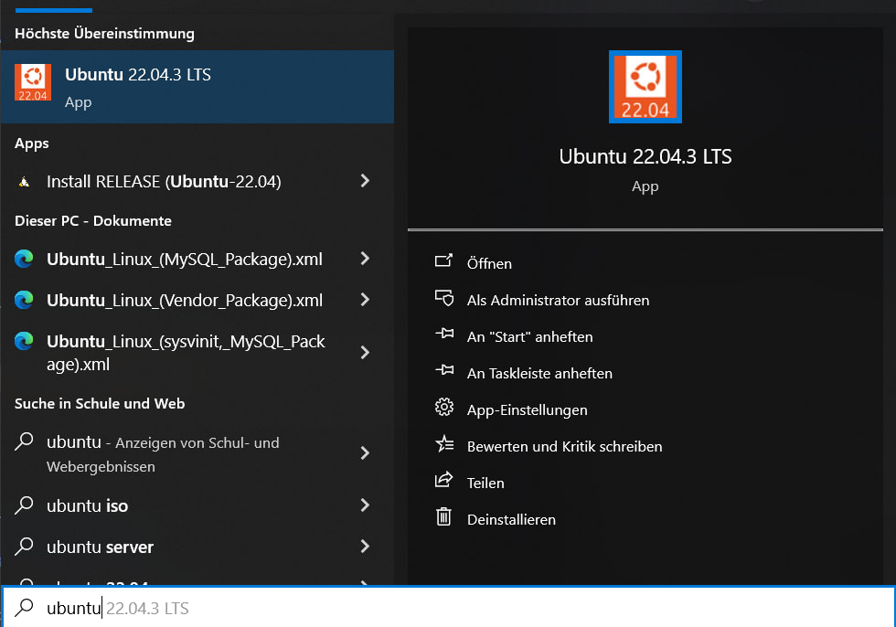


________________________


### Ubuntu-Nutzer anlegen:

Bei der ersten Nutzung der Ubuntu-Distribution als Linux Subsystem muss ein Nutzername und Kennwort vergeben werden.


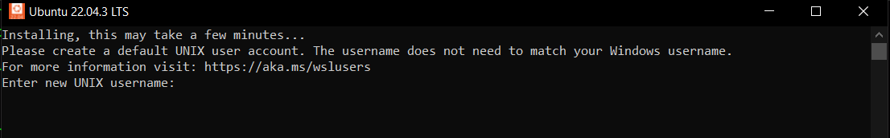


```powershell
Installing, this may take a few minutes...
Please create a default UNIX user account. The username does not need to match your Windows username.
For more information visit: https://aka.ms/wslusers
Enter new UNIX username: art
``` 

Hier wird der User `art` verwendet.


___________________________


###  WSL neu starten:

Um im laufenen Betrieb alle laufenden WSL-Instanzen zu beenden und das Subsystem neu zu starten, kann der folgende Befehl eingesetzt werden:

  ```powershell
  wsl --shutdown
  ```


______________________


#### WSL : Updates und installieren von Ubuntu 22.04

```bash
PS C:\Users\localadmin\WSL2-Linux-Kernel> wsl --update
Installation: Windows-Subsystem für Linux
Windows-Subsystem für Linux wurde installiert.

PS C:\Users\localadmin\WSL2-Linux-Kernel> wsl --install -d Ubuntu-22.04
Der angeforderte Vorgang erfordert erhöhte Rechte.
Optionale Windows-Komponente wird installiert: VirtualMachinePlatform

Tool zur Imageverwaltung für die Bereitstellung
Version: 10.0.19041.3636

Abbildversion: 10.0.19045.4291

Features werden aktiviert
[==========================100.0%==========================]
Der Vorgang wurde erfolgreich beendet.
Der angeforderte Vorgang wurde erfolgreich abgeschlossen. Änderungen werden erst nach einem Neustart des Systems wirksam
.
Wird installiert: Ubuntu 22.04 LTS
Ubuntu 22.04 LTS wurde installiert.
Der angeforderte Vorgang wurde erfolgreich abgeschlossen. Änderungen werden erst nach einem Neustart des Systems wirksam.
PS C:\Users\localadmin\WSL2-Linux-Kernel>
```  


____________________  


### Welcome to Ubuntu mit WSL

```bash
Welcome to Ubuntu 22.04.3 LTS (GNU/Linux 5.15.146.1-microsoft-standard-WSL2 x86_64)

 * Documentation:  https://help.ubuntu.com
 * Management:     https://landscape.canonical.com
 * Support:        https://ubuntu.com/advantage


This message is shown once a day. To disable it please create the
/home/art/.hushlogin file.
art@LAPTOP-123:~$

``` 


   
### Docker-Installation auf Ubuntu 22.04 für Laravel Sail

> artwork: a free project management software for the arts 
>  
>offical :
> https://github.com/artwork-software/artwork?tab=readme-ov-file


- Unterstützte Systeme: macOS, Linux, Windows **(via WSL2).**

- **Erforderliche Installationen:**

  - **Docker:** Zur Erstellung und Verwaltung der Docker-Container.
  
  - **Composer:** Zum Verwalten der PHP-Abhängigkeiten.


________________


  

#### Überblick
Laravel Sail wird vier Docker-Images erstellen:

- **PHP-Projekt**

- **MySQL-Instanz:** Für die Datenbank.

- **Meilisearch-Instanz:** Ermöglicht Fuzzy-Suche.

- **Mailpit-Instanz:** Zum Vorschau der gesendeten E-Mails.

**Hinweis:** 
Stellenstellen, dass  keine Dienste auf den Ports 80 und 3306 laufen.

#### Installationsprozess
1. **Klonen des Git-Repository:**
   ```bash
   git clone https://github.com/artwork-software/artwork.git
   ```
_______________


#### Wechseln Sie in das Projektverzeichnis und bereiten Sie die Umgebungsvariablen vor:**
   ```bash
   cd artwork
   cp .env.example .env
   ```
   


___________


#### Installieren der PHP-Abhängigkeiten mit Composer:

   ```bash
   composer install --ignore-platform-reqs
   ```
   
#### Starten der Docker-Container mit Laravel Sail:**
   ```bash
   ./vendor/bin/sail up
   ```
   Die Docker-Images werden nun erstellt. Es ist empfehlenswert, den Befehl `./vendor/bin/sail` durch einen Shell-Alias zu ersetzen. Die entsprechende Anleitung finden Sie in der Dokumentation. Im weiteren Verlauf wird das Alias `sail` verwendet.

### Zusätzliche Hilfsmittel für eine lokale Entwicklungsumgebung

- **Visual Studio Code oder ein anderer geeigneter Code-Editor.**

- **Postman oder Insomnia für API-Tests.**

- **My-SQL Workbench**
  

   

____________________

## Installationsanleitung für Entwicklungswerkzeuge auf Ubuntu 22.04 (WSL 2)

#### Paketlisten aktualisieren:

   ```bash
   sudo apt update
   ```
   
   
#### Paketlisten aktualisieren:

   ```bash
   sudo apt upgrade
   ```
   _________________
   
#### Grundlegende Entwicklungswerkzeuge installieren:

   ```bash
   sudo apt install build-essential
   ```
   
   _________________
   
   
#### Notwendige Pakete für Docker installieren:

   ```bash
   sudo apt install apt-transport-https ca-certificates curl software-properties-common
   ```
   
   _________________
   
#### Netzwerktools installieren:

   ```bash
   sudo apt install net-tools
   ```
   
   _________________
   
#### Docker und Docker Compose und den Composer installieren:

   ```bash
   sudo apt install docker
   sudo apt install docker-compose
   sudo apt install composer
   ```
   
   _________________
   
#### Versionskontrollsystem Git installieren:

   ```bash
   sudo apt install git
   ```
   
   _________________

#### Python und Pip installieren:

   ```bash
   sudo apt install python3
   sudo apt install python3-pip
  ```
   Python ist immer nützlich. ;) 
   
   

#### Node.js installieren:

   ```bash
   sudo apt install nodejs
   sudo apt install node
   sudo apt install npm
   ```
   
________________________


#### php installieren:

```bash  
sudo apt install php php-cli php-common php-curl php-gd php-mbstring php-xml php-zip php-json php-mysql php-sqlite3 php-pgsql php-bcmath php-intl php-mbstring php-xmlrpc php-soap php-gmp php-imap php-ldap php-pdo php-dom php-simplexml
```

```bash
sudo apt update
```  
  


_________________

#### php restart:

```bash
sudo systemctl restart php
```
  
  ________________


##### Benutzer zur Docker-Gruppe hinzufügen:

   ```bash
   sudo usermod -aG docker ${USER}
   ```
   
   ______________  

### **Port 80 Belegt**

Um den Port 80 freizugeben, der von eventuell von `apache2` belegt ist, sind folgende Schritte erforderlich:

#### Identifikation der Prozesse, die Port 80 verwenden:

   ```bash
   sudo lsof -i :80
   ```
   Dieser Befehl listet alle Prozesse auf, die Port 80 belegen. 
______________________

#### Stoppen des Apache2-Services:


```bash
sudo systemctl stop apache2
```
   
Durch diesen Befehl wird der Apache2-Dienst gestoppt, was den Port 80 freigibt.
   
   ```bash
   sudo systemctl stop nginx
   ```
   
   
   Alternativ wird der ngnix Dienst gestoppt, was den Port 80 freigibt.
   
___________________________

#### Überprüfung, ob Port 80 freigegeben wurde:

   ```bash
   sudo lsof -i :80
   ```
   
   Keine Ausgabe - kein Port belegt.
______________________  

#### Fin.

____________________________
   
   
   
### Composer Update

```bash
composer update --ignore-platform-reqs
```
   

   
   
## 

 <div style="background-color: green; border-left: 6px solid #4caf50; padding: 8px; margin-top: 5px; margin-bottom: 5px;">
    <strong>Hinweis</strong> Nach einem update mit `composer` gelingt das Ausführen mit Lavarel Sail in WSL2  
</div>

##
 ______________
  
   
## **Starten der Laravel-Anwendung** <3
   
```bash
./vendor/bin/sail up
``` 


```bash
art@LAPTOP-IUD4SC6D:~/artwork$ ./vendor/bin/sail up
artwork_laravel.test_1   start-container   Exit 128
Shutting down old Sail processes...
Creating network "artwork_sail" with driver "bridge"
Creating artwork_mailpit_1     ... done
Creating artwork_mysql_1       ... done
Creating artwork_meilisearch_1 ... done
Creating artwork_laravel.test_1 ... done
Attaching to artwork_meilisearch_1, artwork_mailpit_1, artwork_mysql_1, artwork_laravel.test_1
```


### Mailpit
   

- Zugriff auf Mailpit erfolgt über die URL: `http://localhost:8025/`
- Bietet eine Web-basierte Oberfläche, um E-Mails, die von der Anwendung gesendet werden, zu erfassen und anzuzeigen.

   
   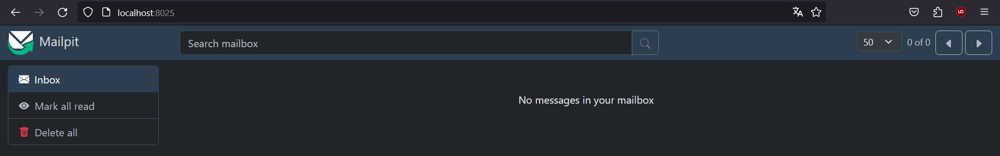
   
_____________


### Melisearch 

- Zugriff auf Meilisearch erfolgt über die URL: `http://127.0.0.1:7700/`
- Meilisearch ist eine Suchmaschine, die für Suchanfragen innerhalb der Anwendung.


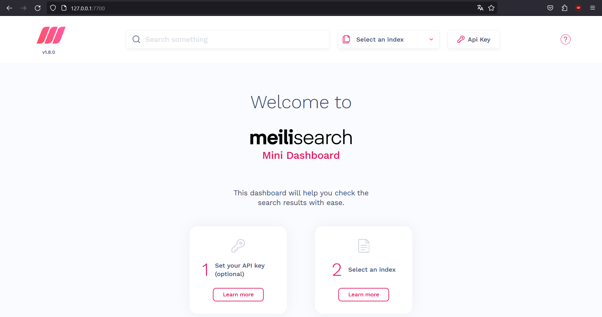


________________


### Laravel Anwendung auf Port 80


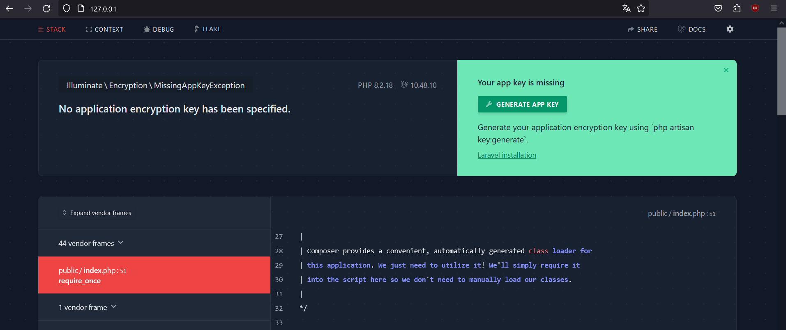


- Die auf Port 80 laufende Laravel-Anwendung zeigt eine Fehlermeldung an:

`Illuminate\Encryption\MissingAppKeyException`


- Dieser Fehler weist darauf hin, dass kein Anwendungsschlüssel festgelegt wurde, was für die Verschlüsselung von Sitzungen notwendig ist.


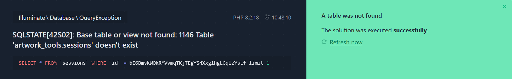


_________________________________________
__________________________________________

### Laravel Frontend-Installation


> artwork: a free project management software for the arts 
>  
>offical :
> https://github.com/artwork-software/artwork?tab=readme-ov-file


In das Git-Arbeitverzeichnis wechseln:

```bash
cd artwork
```


#### Sail-Installation

Um sicherzustellen, dass `sail` installiert ist, den vollständigen Pfad bis zum ausführbaren Sail-Skript verwenden:

```bash
./vendor/bin/sail npm install
```

Nach der Installation können Sicherheitsprobleme behoben werden mit:
```bash
npm audit fix --force
```

____________

#### Anwendungsschlüssel generieren

Einen Anwendungsschlüssel für die Verschlüsselung erzeugen:

```bash
./vendor/bin/sail artisan key:generate
```


Wenn dieser Befehl erfolgreich ist, erscheint eine Bestätigung:

```bash
INFO  Application key set successfully.
```


Doppelt hält beeser.

____________

#### Datenbank mit Testdaten migrieren


```bash
./vendor/bin/sail artisan migrate:fresh --seed
```


____________

#### Aktuelle Datenbank löschen


```bash
./vendor/bin/sail artisan migrate:fresh
```

____________

#### Produktionsdatenbank ohne Testdaten einrichten

Die Produktionsdatenbank ohne Testdaten einrichten und die notwendigen Tabellen erstellen:
```bash
./vendor/bin/sail artisan db:seed:production
```

____________

#### Warteschlangen starten

```bash
./vendor/bin/sail artisan queue:work
```

____________

#### Frontend starten

Das Frontend mit diesem Befehl starten:
```bash
./vendor/bin/sail npm run dev
```

____________

#### Storage-Ordner veröffentlichen

Den `storage`-Ordner veröffentlichen, um das Anwendungslogo sichtbar zu machen:
```bash
./vendor/bin/sail artisan storage:link
```


______________________

### http://localhost

Eine Instanz von Artwork steht lokal verfügbar.

Mit einem Browser aus der lokalen Maschine `http://localhost` aufrufen.


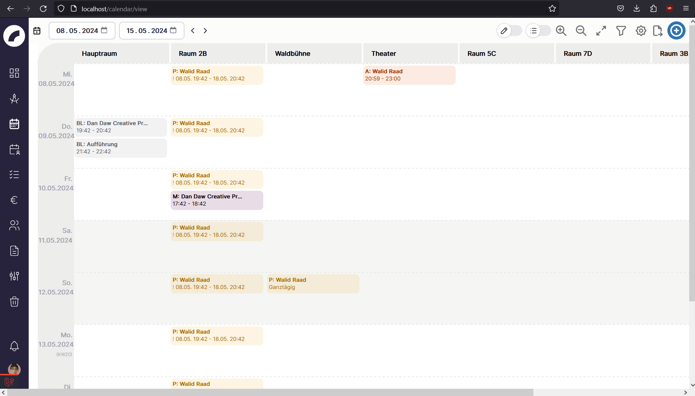

____________

### Artwork Test-Instanz mit Laravel

Wenn die Docker-Installation genutzt wurde und die Datenbank mit Testdaten gefüllt ist, können folgende Anmeldedaten für die Test-Instanz verwendet werden:


> https://github.com/artwork-software/artwork?tab=readme-ov-file


Für das Admin-Konto (mit allen Berechtigungen):
- **Mail**: `anna.musterfrau@artwork.software`
- **Passwort**: `TestPass1234!$`

Für das Benutzerkonto (mit eingeschränkten Berechtigungen):
- **Mail**: `lisa.musterfrau@artwork.software`
- **Passwort**: `TestPass1234!$`

____________


   ____________________
   ______________________
   ________________________
   
   
   
   
   

# Installation von Artwork im Standalone-Betrieb auf einem VPS


## Voraussetzungen


### Systemvoraussetzungen


### Serveranforderungen für Artwork

Artwork funktioniert auf verschiedenen Betriebssystemen, empfiehlt jedoch die Verwendung von `Ubuntu Server (22.04 LTS)` für optimale Stabilität. Abhängig von der Anzahl der Benutzer, die die Anwendung gleichzeitig nutzen werden, variieren die Hardwareanforderungen:

### Minimale Ausstattung
| Ressource      | Spezifikation                      |
| -------------- | ---------------------------------- |
| **vCPU**       | 4 Kerne                            |
| **RAM**        | 8 GB                               |
| **SSD-Speicher** | 256 GB (+ zusätzlicher Speicher abhängig von der Nutzung) |

### Optimale Ausstattung
| Ressource      | Spezifikation                      |
| -------------- | ---------------------------------- |
| **vCPU**       | 8 Kerne                            |
| **RAM**        | 16 GB                              |
| **SSD-Speicher** | 512 GB (+ zusätzlicher Speicher abhängig von der Nutzung) |


### Anforderungen Cloud Computing
#### Hetzner


Hetzner ist ein deutsches Unternehmen, das eine breite Palette von Internet-Hosting-Diensten  anbietet. Es wurde 1997 gegründet und hat sich seitdem zu einem der bekanntesten Anbieter in Deutschland und Europa entwickelt. Hetzner bietet verschiedene Dienstleistungen an, darunter Webhosting, VPS (Virtual Private Servers)und dedizierte Server.

[Hetzner](https://hetzner.com/) 


Ein Auszug aus der Produktpalette. Für ersten Test werden geringe Ressourcen benötigt. 
Für eine langjährige Nutzung mit vielen zeitgleichen Nutzern sollte **CCX33** gewählt werden.
Hier wird **CCX23** gewählt.

| Modell | vCPU  Kerne  | RAM    | NVMe SSD | Traffic | IPv4 | Standorte | Preis pro Stunde | Preis pro Monat |
|--------|--------|--------|----------|---------|------|-----------|------------------|-----------------|
| CCX13  | 2 AMD  | 8 GB   | 80 GB    | 20 TB   | IPv4 |           | 0,0238 €         | 14,86 €         |
|  **★**CX23**★** | 4 AMD  | 16 GB  | 160 GB   | 20 TB   | IPv4 |           | 0,0466 €         | 29,14 €         |
| CCX33  | 8 AMD  | 32 GB  | 240 GB   | 30 TB   | IPv4 |           | 0,0925 €         | 57,70 €         |
| CCX43  | 16 AMD | 64 GB  | 360 GB   | 40 TB   | IPv4 |           | 0,1840 €         | 114,82 €        |
| CCX53  | 32 AMD | 128 GB | 600 GB   | 50 TB   | IPv4 |           | 0,3671 €         | 229,06 €        |
| CCX63  | 48 AMD | 192 GB | 960 GB   | 60 TB   | IPv4 |           | 0,5501 €         | 343,30 €        |


Derzeit wird nur Ubuntu unterstützt!
Es wird ein Root-Konto oder ein Benutzer mit Sudo-Rechten auf dem Ubuntu-System benötigt. Die Installation per Installations-Skript erfolgt vollautomatisch.


### Web-Konfiguration Hetzner


```python
from IPython.display import Image
Image("hetzner1.jpg")
```


    

    


```python
from IPython.display import Image
Image("hetzner2.jpg")
```


    

    


```python
from IPython.display import Image
Image("hetzner3.jpg")
```


    

    


```python
from IPython.display import Image
Image("hetzner4.jpg")
```


    

    


```python

```


```python

```

## Server anlegen
___________
### Standort

Hier wird **Falkenstein** gewählt
_____________
### Image

- **Betriebssystem**: Ubuntu 22.04 Long time support

_______________
## Networking


- **IPv4-Kosten**: 0,00095 €/h für Primäre IPv4-Adressen, unabhängig von der Zuweisung.
- **IPv6-Adressen**: Kostenlos. hehe

Standard Einstellungen
__________________
### SSH-Keys

- **Sicherheit**: Authentifizierung über SSH-Keys sicherer als herkömmliche Passwort-Authentifizierung.
- 
- **Format**: SSH-Key muss im OpenSSH-Format vorliegen. Es muss auf dem lokalen Computer ein SSH -Schlüsselpaar erzeugt werden.

<font color="red">Dieser Schritt wird hier übersprungen.</font>

 
 Verwendung eines SSH-Keys wird empfohlen; sonst wird <font color="green">**ein Root-Passwort per E-Mail** versendet. </font>

_______________________
### Volumes

kein weiterer Speicherplatz
______________________
### Firewalls

none
____________________
### Backups


In produktiver Umgebung kann dieser Backup-Dienst nützlich sein, ist aber vergleichmäßig teuer. 

- **Kosten**: Monatliche Kosten von 20% des Serverpreises; Volumes nicht in Backups enthalten.

_________________________
### Servername

Ganz unten muss ein Servername vergeben werden. Sonst bekommt man eine kryptische Kennung als Namen vergeben.

```
artwork
```

___________

### Öffentliche IP-Adresse

Hetzner vergibt eine öffentliche IPv4-Adresse.
Unter dieser Adresse ist der VPS-Rechenknoten nun über das Internet erreichbar.


```python
from IPython.display import Image
Image("hetzner5.jpg")
```


    

    


_____________________
##  DNS-Records bei einem Domain-Register

Für eine IPv4 - Adresse muss mindestesn ein `A - Record` bei einem Domain-Register gesetzt werden.

### Setzen eines A -Records

Um die Artwork-Installation über das Internet erreichbar zu machen, muss ein Domain-Record gesetzt werden.

Die **Subdomain** ist: `artwork`

Die **Domain** ist: `meinefirma`

Die **Top-Level-Domain** ist zu Beispiel: `.de`

Zusammen also: `artwork.mainefirma.de`

Es ist ein A Record in den DNS Einträgen zu setzen.

`artwork ` der `öffentlichen IP-Adresse` von Hetzner zuweisen.

#### Zusätzliche Domain Records:

- AAAA -Record für IPv6 Erreichbarkeit
- MX -Record für Emailversand vom gleichen Server (falls nötig)
- TXT - Record (fortgeschrittene nutzung)
____________________________

______
__________

## Root-Zugang per SSH mit der Powershell


```python
from IPython.display import Image
Image("powershell1.jpg")
```


    

    


Um über die PowerShell eine SSH-Verbindung zu einem Server herzustellen und den Fingerprint zu bestätigen, werden folgende Schritte durchgeführt:

1. Ein root-Passwort wird an die Email-Adresse des Hetzner Kontos gesendet. Diese Logindaten nutzen um per SSH- Fernzugriff zu verbinden.
    - IP-Adresse
    - root-Nutzer
     - root-Passwort

3.  Auf dem lokalen System wird die PowerShell geöffnet.

SSH-Verbindung aufbauen:
Der SSH-Befehl wird verwendet, um eine Verbindung zum VPS herzustellen:
```bash
ssh root@123.245.123
```


Ersetzen von der IP-Adresse mit der tatsächlichen IP-Adresse des VPS-Servers.

2. Fingerprint bestätigen:

Bei der ersten Verbindung zu einem Server über SSH wird der SSH-Fingerprint des Servers angezeigt.
PowerShell fragt, ob man dem Host vertrauen möchte. Um fortzufahren, muss `yes` eingegeben und bestätigt werden, um den Fingerprint zu akzeptieren und die Verbindung zu sichern.

3. Verbindung herstellen und Testkommando ausführen:

```
whoami
```

____________________
____________________


## Erste Schritte auf einem VPS
### Benutzer hinzufügen

   - Befehl zum Hinzufügen eines neuen Benutzers "art":
```bash
adduser art
```
   - Passwort für den neuen Benutzer eingeben und durch erneute Eingabe bestätigen.
___________
### Benutzer zu sudoers hinzufügen 
   - sudoers-Datei mit einem Editor öffnen, z.B.:
```bash
nano /etc/sudoers
```

   - Folgende Zeile hinzufügen, um dem Benutzer `art` sudo-Rechte zu gewähren:

```bash
art ALL=(ALL) ALL
```

#### Änderungen speichern und schließen

Nach dem Hinzufügen der Zeile die Änderungen speichern und nano schließen. Dies erfolgt in nano durch Drücken von Ctrl+O (zum Speichern), Enter (zum Bestätigen des Dateinamens) und Ctrl+X (zum Schließen des Editors).

#### Alternative zu nano - Nutzung von visudo

Bei der Veränderung von `/etc/sudoers` ist es möglich, bei fehlerhaften Eingaben, sich selbst vom System auszusperren. Deshalb wird die Nutzung von `visudo` für das Ändern der `sudoers`Datei empfohlen, hier aber nicht beschrieben

_______________
### Zu Benutzer `art` wechseln
   - Zum neuen Benutzerkonto wechseln mit:
```bash
su art
```
____________________
### Paketquellen aktualisieren
   - Paketquellen des Systems aktualisieren:

```bash
sudo apt update
```
___________________
### weitere Pakete installieren
   - Pakete `fail2ban`, `ufw` (Uncomplicated Firewall) und `git` installieren:
```bash
sudo apt install fail2ban ufw git
```

__________
### UFW-Konfiguration

- **HTTPS freigeben**:

```bash
sudo ufw allow https
```


- **HTTP freigeben (Port 80)**:

```bash
sudo ufw allow 80
```

- **SSH freigeben**:
```bash
sudo ufw allow ssh
```


- **Nginx freigeben**:

```bash
sudo ufw allow 'Nginx Full'
```


- **UFW aktivieren**:
```bash
sudo ufw enable
```


- **UFW-Status überprüfen**:


```bash
sudo ufw status
```


Diese Befehle konfigurieren die Firewall so, dass sie den Zugriff auf wesentliche Web- und SSH-Dienste ermöglicht.

_____________

### Installation von Fail2Ban

Fail2Ban sichert den SSH Zugang per Passwort ab.

Zuerst muss Fail2Ban installiert werden:


```bash
sudo apt install fail2ban
```

#### Grundlegende Konfiguration von Fail2Ban

Fail2Ban wird mit einer Hauptkonfigurationsdatei (jail.conf) geliefert, die nicht direkt bearbeitet werden sollte, da Änderungen bei einem Update überschrieben werden können. Stattdessen erstellt man eine lokale Kopie (jail.local), die Vorrang hat.

Erstellen der lokalen Konfigurationsdatei

```bash
sudo nano /etc/fail2ban/jail.local
```

Es kann folgende Beispielkonfiguration eingefügt werden.

```bash
[DEFAULT]
# Sperrt Hosts für eine Stunde:
bantime = 3600

# Eine IP-Adresse wird gesperrt, wenn sie innerhalb von 10 Minuten 5 fehlgeschlagene Anmeldeversuche hat
findtime = 600
maxretry = 5

# Ignoriert lokale Netzwerkadressen
ignoreip = 127.0.0.1/8

# Aktion, die ausgeführt wird, ist das Sperren der IP
action = %(action_mwl)s

[sshd]
enabled = true
port    = ssh
filter  = sshd
logpath = /var/log/auth.log
maxretry = 3

```


__________________
____________________

## Installation von Artwork auf einem Ubuntu-Server
- Root-Zugang oder ein Benutzer mit Sudo-Rechten ist erforderlich.
- Die Installation erfolgt vollautomatisch ohne Eingabeaufforderungen.


### Wechsel in das Benutzerverzeichnis
   - Mit dem Benutzer `art` in das Home-Verzeichnis wechseln:
 ```bash
     cd /home/art
```
________
### Klonen des Artwork Git-Repository
   - Das Repository von GitHub klonen:
```bash
     git clone https://github.com/artwork-software/artwork.git
```
___________
### Wechsel in das Repository-Verzeichnis
   - In das geklonte Verzeichnis wechseln:
```bash
     cd artwork
```
__________
### Berechtigungen für das Installationsskript setzen
   - Dem Skript `ubuntu-install.sh` Ausführungsrechte geben:
```bash
     chmod 755 ubuntu-install.sh
```
___________
### Ausführen des Installationsskripts

```bash
     ./ubuntu-install.sh
```
_____________
Dieses Skript wird Artwork als eigenständige Anwendung installieren. Es umfasst die Einrichtung notwendiger Komponenten wie Nginx, PHP, und andere Abhängigkeiten, die für den Betrieb von Artwork erforderlich sind. 


### Was macht das Skript?


Installation von nginx als Webserver und Einrichtung einer Standardkonfiguration. Diese überschreibt die bestehende Standardkonfiguration. 


- Installation von MySQL 8 und Erstellung eines Benutzerkontos für die Anwendung sowie Befüllung der Datenbank.
- Installation von NodeJs in der Version 18.x (LTS).
- Erstellung eines Dienstes für den Queue-Worker.
- Einrichtung eines Cronjobs für geplante Zeitpläne.
- Installation von Soketi (global) als Pusher-kompatibler Dienst und dessen Daemonisierung.
- Einrichtung und Installation von PHP mit allen benötigten Plugins.
- Installation von Meilisearch.
- Installation von Artwork selbst.

Es wird dringend davon abgeraten, den Installer mehrmals auszuführen, da einige Schritte nur einmal ausgeführt werden sollen.

### Was macht das Skript nicht?

- SSL Zertifikate

___________
______________

## SSL-Zertifikatinstallation für Artwork auf einem Ubuntu-Server

____________

### Let's Encrypt

bietet eine automatisierte Dienstleistung zur Ausstellung von SSL/TLS-Zertifikaten an, die verschlüsselte Verbindungen via `https`   im Internet ermöglicht. Um diesen Dienst zu nutzen, ist das Dienstprogramm `Certbot` zu empfehlen.
     
     


### Certbot und Nginx installieren
Zuerst müssen Certbot und Nginx installiert werden, falls noch nicht geschehen:
```bash
     sudo apt update
     sudo apt install certbot python3-certbot-nginx
```

### Certbot für automatische SSL-Konfiguration verwenden
   - Certbot automatisiert die SSL-Konfiguration für Nginx und erneuert die Zertifikate:
```bash
     sudo certbot --nginx --redirect --agree-tos --no-eff-email --email meine@mail.de -d artwork.meinewebsite.de
```
   - Optionen erklärt:
     - `--nginx`: Verwendet den Nginx-Plugin.
     - `--redirect`: Erstellt eine Umleitung von HTTP zu HTTPS.
     - `--agree-tos`: Stimmt den Nutzungsbedingungen automatisch zu.
     - `--no-eff-email`: Verzichtet auf zusätzliche E-Mails außer Erneuerungsbenachrichtigungen.
     - `--email`: Gibt die E-Mail-Adresse für wichtige Benachrichtigungen an.
     - `-d`: Spezifiziert die Domain für das SSL-Zertifikat. <-- Super Wichtig!
   
   __________________
   
   
   Die erstellen Dateien sind Teile des SSL-Zertifikats, das von `Let's Encrypt` bereitgestellt wird:

```bash
/etc/letsencrypt/live/artwork.meinewebsite.de/fullchain.pem
```
Diese Datei enthält das SSL-Zertifikat zusammen mit allen Zwischenzertifikaten.

```bash
/etc/letsencrypt/live/artwork.meinewebsite.de/privkey.pem
```
Diese Datei enthält den privaten Schlüssel des Zertifikats.


______________________

### SSL-Zertifikat nicht erfolgreich installiert
Bei vorhandenem DNS-Record zu einer Domain meldet Certbot ein Zertifikat bei LetsEncrypt an.
Durch die Standard-Nginx Konfiguration von artwork muss das Zertifikat manuell gesetzt werden. Certbot gibt dort einen Fehler aus. Den Pfad des gelandenen Zertifikat kopieren. 
In der Datei 

```bash
sudo nano /etc/nginx/sites-enabled/default
```

müsen die Pfade zu den Zertifikaten von oben  manuell gesetzt werden.


```bash
map $http_upgrade $connection_upgrade {
    default upgrade;
    '' close;
}

server {
    listen 80;
    server_name artwork.meinewebsite.de;
    listen 443 ssl;
    ssl_certificate /etc/letsencrypt/live/artwork.meinewebsite.de/fullchain.pem;
    ssl_certificate_key /etc/letsencrypt/live/artwork.meinewebsite.de/privkey.pem;

# Empfohlene SSL-Einstellungen
    ssl_protocols TLSv1.2 TLSv1.3;
    ssl_ciphers 'ECDHE-ECDSA-CHACHA20-POLY1305:ECDHE-RSA-AES128-GCM-SHA256:ECDHE-RSA-AES256-GCM-SHA384';
    ssl_prefer_server_ciphers on;
    ssl_session_cache shared:SSL:10m;

    #SSL Settings
    #ssl_certificate /poth/to/cert;
    #ssl_certificate_key /path/to/key;
    #listen 443 ssl;

    root /var/www/html/public;
    index index.php index.html;

    location ~ \.php$ {
       try_files $uri =404;

       fastcgi_split_path_info ^(.+\.php)(/.+)$;
       fastcgi_pass unix:/run/php/php8.2-fpm.sock;
       fastcgi_index index.php;

       include fastcgi_params;
       fastcgi_param SCRIPT_FILENAME $document_root$fastcgi_script_name;
       fastcgi_param PATH_INFO $fastcgi_path_info;
    }

    location / {
      try_files $uri $uri/ /index.php$is_args$args;
    }
}

```


Die Datei, die Sie hier beschrieben ist, ist eine .env-Datei (Environment-Konfigurationsdatei) für eine Laravel-basierte Anwendung, die auf dem Server läuft. Diese Datei enthält Umgebungsvariablenn für die Anwendung. Umgebungsvariablen sind Schlüssel-Wert-Paare, die zur Konfiguration von Aspekten der Anwendungsumgebung verwendet werden, ohne den Code zu ändern.


Die .env-Datei im Verzeichnis 

```bash
sudo nano /var/www/html/.env 
``` 
bearbeiten.
Den Eintrag APP_URL=http://localhost finden und http://localhost durch die eigene Domain ersetzen. HTTP oder HTTPS sind erforderlich.

Hier ein Beispiel wie es mit der Domain `https://artwork.meinewebsite.de` zu konfigurieren ist.

```bash

art@ubuntu-8gb-fsn1-1:/var/www/html$ cat /var/www/html/.env
APP_NAME=Artwork
APP_ENV=production
APP_KEY=base64:VFib2131231tW1418uoJLG1231i29/Y6Yp3TFOg=
APP_DEBUG=false
APP_URL=https://artwork.meinewebsite.de

LOG_CHANNEL=stack
LOG_DEPRECATIONS_CHANNEL=null
LOG_LEVEL=debug

TEST_DB_DATABASE=artwork_tools_test
DB_CONNECTION=mysql
DB_HOST=localhost
DB_PORT=3306
DB_DATABASE=artwork_tools
DB_USERNAME=artwork
DB_PASSWORD=082fd74e0asd39dfewqdwdqeqedal-als-ob-bruder-46abac01e1308e00

SCOUT_DRIVER=meilisearch
MEILISEARCH_HOST=http://localhost:7700
SCOUT_QUEUE=true

CACHE_DRIVER=redis
FILESYSTEM_DISK=local
QUEUE_CONNECTION=database
SESSION_DRIVER=redis
SESSION_LIFETIME=120

MEMCACHED_HOST=127.0.0.1

REDIS_HOST=127.0.0.1
REDIS_PASSWORD=null
REDIS_PORT=6379

MAIL_HOST=
MAIL_PORT=
MAIL_MAILER=
MAIL_USERNAME=Inbox-Name
MAIL_PASSWORD=
MAIL_ENCRYPTION=

AWS_ACCESS_KEY_ID=
AWS_SECRET_ACCESS_KEY=
AWS_DEFAULT_REGION=us-east-1
AWS_BUCKET=
AWS_USE_PATH_STYLE_ENDPOINT=false

BROADCAST_DRIVER=pusher
PUSHER_APP_KEY=122345
PUSHER_APP_ID=123345
PUSHER_APP_SECRET=112345
PUSHER_APP_CLUSTER=mt1
PUSHER_HOST=ip adresse hier einsetzen <------    xxx.xxx.xxx.xxx
PUSHER_PORT=6001
PUSHER_SCHEME=https

MIX_PUSHER_APP_KEY="${PUSHER_APP_KEY}"
MIX_PUSHER_HOST="${PUSHER_HOST}"
MIX_PUSHER_PORT="${PUSHER_PORT}"

LARAVEL_WEBSOCKETS_PORT=${PUSHER_PORT}
DEBUGBAR_ENABLED=FALSE

SENTRY_LARAVEL_DSN=
SENTRY_TRACES_SAMPLE_RATE=1.0
VITE_SENTRY_DSN_PUBLIC="${SENTRY_LARAVEL_DSN}"


SOKETI_SSL_CERT=/etc/letsencrypt/live/artwork.meinewebsite.de/fullchain.pem
SOKETI_SSL_KEY=/etc/letsencrypt/live/artwork.meinewebsite.de/privkey.pem
SOKETI_SSL_CA= # Optional, wenn eine CA verwendet wird
SOKETI_SSL_PASS= # Optional, wenn ein Passwort für den Schlüssel benötigt wird


```
__________

_____________


### Für E-Mail-Support
Für automatische Email wird ein SMTP-Server benötigt.

Im selben File den folgenden Block lokalisieren und mit den eigenen Zugangsdaten ausfüllen:

```bash
MAIL_HOST=smtp.example.com
MAIL_PORT=587 (Beispielport - kann abweichen)
MAIL_MAILER=smtp
MAIL_USERNAME=your-email@example.com
MAIL_PASSWORD=your-email-password
MAIL_ENCRYPTION=tls

```
_________________
_______________  
  
  ## Updateprozess der Standalone-Installation
  
Um das Skript `update.sh` im Verzeichnis `artwork` auszuführen sind folgende Befehle erforderlich.


```bash
cd artwork
chmod 755 update.sh
./update.sh
```

Das `update.sh` Skript benötigt root-User Privilegien, da es Befehle mit `sudo` ausführt.
  
  
  ```bash
  
  #!/usr/bin/env bash

#Update OS
sudo apt-get update
sudo NEEDRESTART_MODE=a apt-get dist-upgrade -y

#Get new code
sudo git -C /var/www/html pull

#Install dependencies
sudo COMPOSER_ALLOW_SUPERUSER=1 php /var/www/html/composer.phar -d /var/www/html --no-interaction install

sudo chown -R www-data:www-data /var/www/html

#Clear cache and update db
sudo php /var/www/html/artisan cache:clear
sudo php /var/www/html/artisan optimize
sudo php /var/www/html/artisan migrate --force

## Setup js
sudo npm --prefix /var/www/html install
#First dev, then prod to bake the keys into soketi(pusher)
sudo npm --prefix /var/www/html run dev
sudo npm --prefix /var/www/html run prod

sudo chown -R www-data:www-data /var/www/html

sudo systemctl restart artwork-worker


```


### Hauptaufgaben des Skripts `update.sh`:

#### Betriebssystem aktualisieren:
   
   Es stellt sicher, dass das Betriebssystem, auf dem der Server läuft, die neuesten Sicherheitspatches und Updates erhält.
   
   
   ___________________
   
   
##### Neuesten Quellcode holen:
   
   Das Skript aktualisiert den Code der Webanwendung auf dem Server, indem es die neueste Version aus dem offiziellen Git-Repository zieht.
   
   ______________
   
   
   
#### Abhängigkeiten installieren:


   
   Alle erforderlichen PHP- und JavaScript-Bibliotheken und -Pakete werden installiert oder aktualisiert.
   
   
   
   ____________
   
#### Anwendungsressourcen und Datenbank aktualisieren:
   
   Das Skript führt Befehle aus, die spezifisch für (php) Laravel sind, wie das Löschen des Caches oder das Durchführen von Datenbankmigrationen
   
   _____________________
   
#### Dienste neu starten:
   
  Nachdem alle Updates durchgeführt wurden, wird der spezifische Dienst der Anwendung (ein Background Worker) neu gestartet, um alle Änderungen zu übernehmen und die Anwendung neu zu starten.
________________________  
___________________________

## Backup-Management mit `artwork`

Backups sind entscheidend für die Absicherung von Daten und deren Wiederherstellung nach Datenverlust durch Systemfehler oder Datenkorruption. Für die `MySQL-Datenbank` der Software `Artwork` sollte ein regelmäßiges Backup erstellt werden. In einer produktiven Umgebung sollte dies in festen Invervallen geschehen.

Das hier beschriebene Verfahren ermöglicht das Exportieren von Backups der "Artwork"-Datenbank und dessen Archivierung lokal. Diese Anleitung demonstriert, wie ein manuelles Backup erstellt wird. Der Backup-Prozess sollte per Skript automatisiert werden.

### Werkzeugkette Datenbank-Management


### Grafische Benutzeroberflächen (GUIs) für Datenbanksysteme:

1. **MySQL Workbench**: [MySQL Workbench Webseite](https://www.mysql.com/products/workbench/)
2. **phpMyAdmin**: [phpMyAdmin Webseite](https://www.phpmyadmin.net/)
3. **DBeaver**: [DBeaver Webseite](https://dbeaver.io/)
  
_______________  

### Installation mit dem Paketmanager Scoop unter Windows

**Scoop** ist ein Kommandozeilen-Installer für Windows, der das Installieren und Verwalten von Anwendungen vereinfacht.

**Projektwebseite**: [Scoop Webseite](https://scoop.sh/)


### Installation von Scoop Paketmanager:
PowerShell öffnen und folgendende Befehle ausführen:


```bash
Set-ExecutionPolicy RemoteSigned -Scope CurrentUser
```

Gibt dem lokalen Benutzer in der Powershell Rechte signierte Skripe auszuführen.
Scoop wird automatisiert per Skript instlaliert.


```bash
iwr -useb get.scoop.sh | iex
```

Installiert die Paketverwaltung `scoop`auf dem lokalen Benutzerkonto eines Windows-Computer.


### Installieren von Git mit Scoop

```bash
scoop install git
```
Git wird für die scoop Paketverwaltung benötigt.


### Hinzufügen des Extras-Buckets in Scoop:
```bash
scoop bucket add extras
```


Zum hinzufügen des Extras Bucket ( erweiterte Programmbibliothek) wird `git` benötigt.
In diesem `Bucket` ist das erforderliche Programm für das Backup-Management enthalten.


### Suche nach Paketen mit Scoop:
```bash
scoop search sql
```

Diese Suche gibt alle Softwarenamen aus, die mit scoop zu installieren sind. Dabei auch MySQL - Workbench - im Bucket `extras`

Ausgabe von der Suche mit Scoop:

```bash

PS C:\Users\localadmin> scoop search sql
Results from local buckets...

Name                          Version         Source Binaries
----                          -------         ------ --------
cloud-sql-proxy               2.11.0          main
csvtosql                      v0.1.1-alpha    main
go-sqlcmd                     1.6.0           main
mariadb                       11.3.2          main   mysql.exe | mysqladmin.exe | mysqlbinlog.exe | mysqlcheck.ex...
mysql-lts                     8.0.36          main
mysql-workbench               8.0.36          main
mysql                         8.3.0           main
octosql                       0.12.2          main
oracle-instant-client-sqlplus 21.13.0.0.0     main
postgresql                    16.2            main
sqlcl                         24.1.0.087.0929 main
sqldef                        0.17.6          main
sqlite                        3.45.3          main
sqlpage                       0.20.4          main
usql                          0.18.1          main
aws-nosql-workbench           3.13.0          extras
falcon-sql-client             4.1.0           extras
heidisql                      12.6            extras
sql-workbench                 130             extras
sqlitebrowser                 3.12.2          extras
sqlitespy                     1.9.24          extras
sqlitestudio                  3.4.4           extras
sqlyog-community              13.2.1          extras
squirrel-sql                  4.7.1           extras
tinode-mysql                  0.22.12         extras
xampp                         8.2.12-0        extras mysql.exe | mysqld.exe

```

### Installation von MySQL Workbench mit Scoop:
```bash
scoop install mysql-workbench
```
Vóila!

Die Software mysql-workbench lässt sich nutzen um Metriken der Datenbank zu erhalten. Daten zu Manipulieren oder um ein ganzes Backup der Datenbank zu erstellen.

________________________

### Artwork- Datenbank einen neuen Remote-User hinzufügen

Um einen neuen MySQL-Benutzer zu erstellen und diesem Benutzer Berechtigungen zu erteilen, werden die folgenden Befehle verwendet. Dies sollte auf dem Server ausgeführt werden, auf dem die MySQL-Datenbank läuft, üblicherweise über die MySQL-Konsole.

```bash
# Anmeldung am MySQL-Server. Der Nutzer artwork zu root-Zugriff auf die Datenbank
mysql -u artwork -p
```
Dies ist der Datenbank-Nutzer, der während der Installation von `artwork` angelegt wurde.  
  
Das Passwort zu diesem Nutzer befindet sich in der .env-Datei unter `/var/www/html/.env `

```bash
sudo cat /var/www/html/.env
```
offenbart dieses Passwort.


Die folgenden Befehl müssen in der MySQL-Shell ZEILENWEISE! eingegen werden und mit einem Semikolon ` ; ` beendet und mit ENTER bestätigt werden.

Dies erstellt einen neuen Nutzer der Datenbank mit einem Passwort. Danach wird der Zugang zur Datenbank dem neuen Nutzer gewährt. Zum Schluss werden die neuen Berechtigungen in der Datenbank ausgerollt. (flushed)

Mit `exit` wird die MySQL-Shell beendet

Die folgenden Angaben:

`neuerBenutzer`

`EinSicheresPasswort123!`
unbedingt ändern!

```sql

-- Erstellung eines neuen Benutzers und Gewährung von Admin-Rechten

CREATE USER 'neuerBenutzer'@'%' IDENTIFIED BY 'EinSicheresPasswort123!';

GRANT ALL PRIVILEGES ON artwork_tools.* TO 'neuerBenutzer'@'%';

FLUSH PRIVILEGES;

exit

```


**Wichtig:**
Die Verwendung von `'%'` als Host erlaubt Verbindungen von jedem Host aus. Dies kann ein Sicherheitsrisiko darstellen. Der Host sollte auf eine spezifische IP-Adresse beschränkt oder SSH-Tunneling verwendet werden

________________________

### Entfernte MySQL-Datenbank per SSH-Tunneling lokal erreichen

In der Powershell muss ein SSH-Tunnel zum artwork-Server aufbebaut werden, um die Datenbank zu erreichen.

```bash
ssh -L 3307:localhost:3306 art@artwork.meine-firma.de -N
```
Nach der Eingabe des Passworts und erfolgreicher Authentifizierung scheint es, als ob nichts weiter passiert, weil der Befehl mit der Option -N ausgeführt wird, die verhindert, dass ein Remote-Shell-Zugriff geöffnet wird. Tatsächlich wird jedoch eine dauerhafte Portweiterleitung im Hintergrund eingerichtet, die es ermöglicht, den MySQL-Server des entfernten Systems so zu nutzen, als wäre er lokal auf dem eigenen Rechner verfügbar. 
Das Fenster mit der SSH-Shell muss geöffnet bleiben, damit die Verbindung funktioniert. Der SSH-Tunnel ermöglicht eine sichere Verbindung zum MySQL-Server über den lokalen Port 3307, solange das Terminalfenster aktiv ist. 


## Verbindung mit einer entfernten Datenbank mit mysql-workbench

### 1.Schritt - mysql-workbench öffnen

Das Prgrogramm `mysql-workbench` aus der Startleiste unter Windows öffnen.

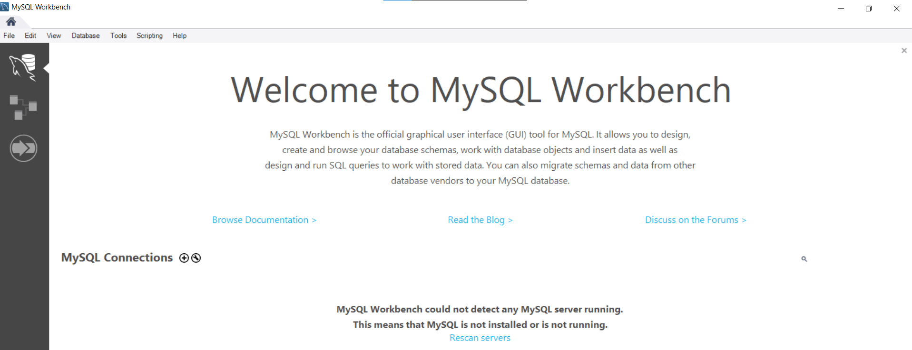

### 2.Schritt

Im Reiter `Database` die Option `Connect to Database` auswählen.

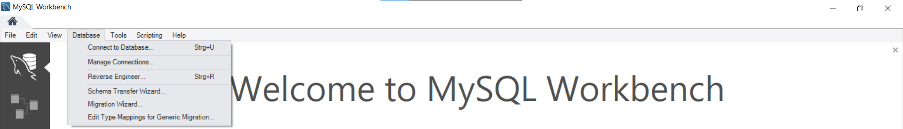

### 3.Schritt - Zugangsdaten eingeben.


Hier eine kurze Anleitung zur Konfiguration einer Verbindung mit der Methode "Standard TCP/IP over SSH" in MySQL Workbench:

1. **SSH Hostname**:
   - `artwork.meine-firma.de:22` eintragen.

2. **SSH Username**:
   - `art` eingeben.

3. **SSH Password**:
   - Option "Store in Vault" wählen, SSH-Passwort eingeben und speichern.

4. **MySQL Hostname**:
   - `localhost` eintragen.

5. **MySQL Server Port**:
   - Wert bei `3306` belassen.

6. **Username**:
   - den neuen MySQL-Username verwenden.
        (siehe oben)
7. **Password**:
   - Option "Store in Vault" wählen, MySQL-Passwort eingeben und speichern.

8. **Default Schema**:
   - Feld leer lassen, es sei denn, direkte Verbindung zu einem spezifischen Schema gewünscht.

Alle erforderlichen Informationen korrekt eingeben, um Verbindungsprobleme zu vermeiden.

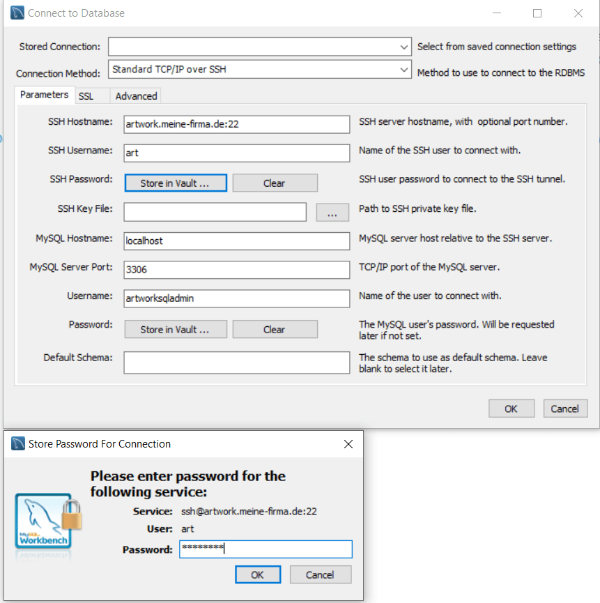

### 4. Schritt -  MySQL- Datenbank Metriken

Die Überwachung von einer MySQL-Datenbank in Echtzeit ist mit mysql-workbench während des produtiven Betriebs möglich.
Diese Metriken helfen, Leistungsengpässe zu identifizieren und die Serverantwortzeiten einzusehen.


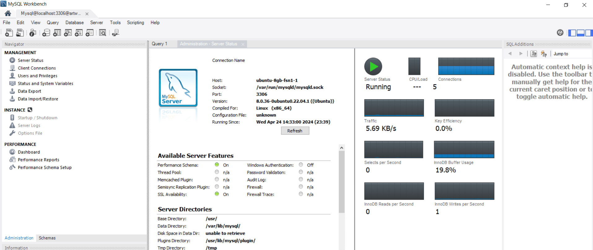


### 5.Schritt - Backups erstellen

Mit der Funktion Data-Export kann die gesamte Datenbank als `Dump` exportiert werden.  
Ein `Dump` im Kontext von Datenbanken ist eine Datei, die alle Daten und auch die Struktur einer Datenbank enthält. Dies ermöglicht ein vollständiges Backup um die Datenbank an einem anderen Ort oder zu einem anderen Zeitpunkt komplett wiederherzustellen.


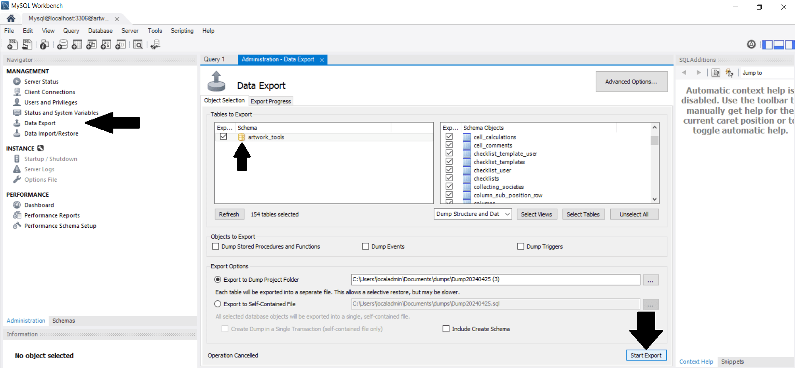

### 6.Schritt - Überprüfung des Exports

